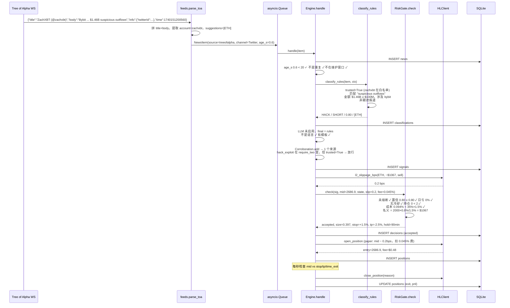
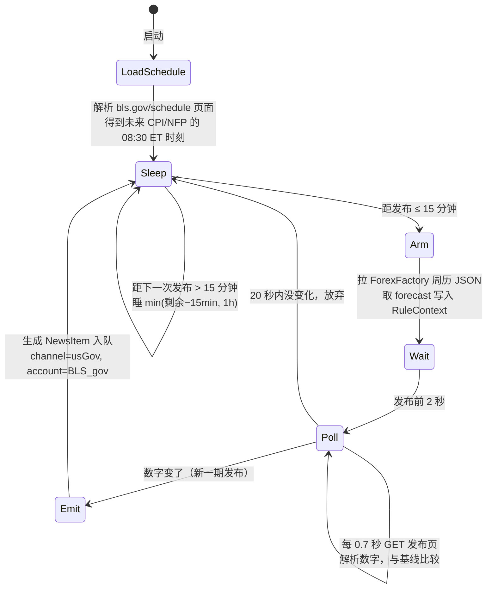
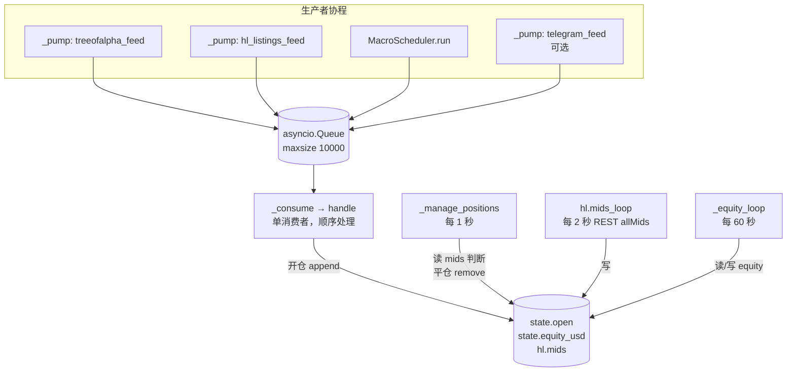
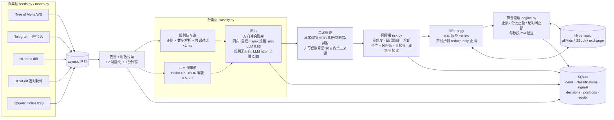
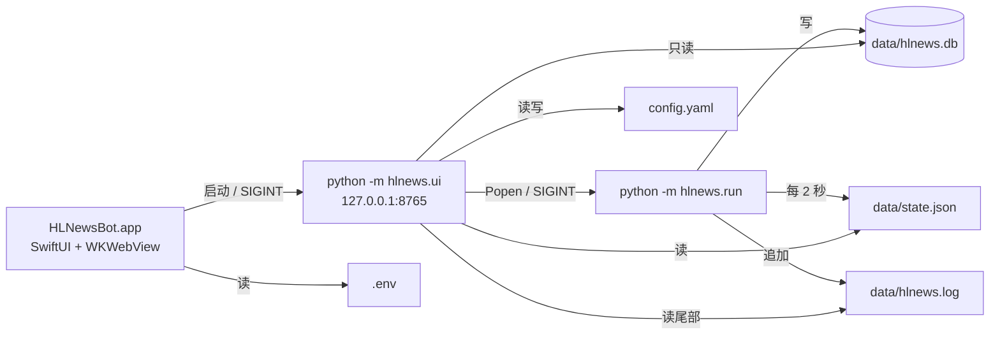

# hl-news-bot

> 一个在 Hyperliquid 永续合约上做新闻事件交易的 Python bot。接免费新闻流，用规则 + 可选 LLM 把标题翻译成"事件类 / 方向 / 置信度 / 标的"，过风控闸后按事件模板开仓，止损挂在交易所、止盈和时间止损在本地。默认 **paper 模式**：真实新闻、真实价格、模拟成交，不碰钱。

这份 README 分两部分。**第一部分是运行手册**：每一条新闻进来之后发生了什么、为什么是这样设计、哪个参数管哪件事、出了问题去哪看。**第二部分是架构设计与可行性结论**：延迟预算、实证数据、事件模板的来源、最小资金、以及对"200% 年化"这个问题的数学回答。第二部分同时以独立文件保存在 [`docs/HL-news-bot-design.md`](docs/HL-news-bot-design.md)。

---

## 目录

**第一部分：运行手册**

1. [这套系统在赌什么](#1-这套系统在赌什么)
2. [十分钟跑起来](#2-十分钟跑起来)
3. [一条新闻的完整生命周期](#3-一条新闻的完整生命周期)
4. [模块逐个讲](#4-模块逐个讲)
   - 4.1 [models.py：五个数据类型](#41-modelspy五个数据类型)
   - 4.2 [feeds.py：新闻从哪来](#42-feedspy新闻从哪来)
   - 4.3 [macro.py：定时宏观数据的直采](#43-macropy定时宏观数据的直采)
   - 4.4 [classify.py：双车道分类器](#44-classifypy双车道分类器)
   - 4.5 [engine.py：主循环、去重、佐证、融合、持仓管理](#45-enginepy主循环去重佐证融合持仓管理)
   - 4.6 [risk.py：风控闸与仓位计算](#46-riskpy风控闸与仓位计算)
   - 4.7 [hl.py：行情、滑点估计、paper 与 live 执行](#47-hlpy行情滑点估计paper-与-live-执行)
   - 4.8 [store.py：SQLite 里有什么](#48-storepysqlite-里有什么)
   - 4.9 [backtest.py：事件回测器](#49-backtestpy事件回测器)
   - 4.10 [run.py：入口与命令行](#410-runpy入口与命令行)
5. [config.yaml 逐项解释](#5-configyaml-逐项解释)
6. [事件模板：每一类为什么是这些数字](#6-事件模板每一类为什么是这些数字)
7. [并发模型：五个协程怎么协作](#7-并发模型五个协程怎么协作)
8. [日志怎么读、数据库怎么查](#8-日志怎么读数据库怎么查)
9. [从 paper 到 live 的三道门](#9-从-paper-到-live-的三道门)
10. [Hyperliquid 的几个坑，以及代码里对应的处理](#10-hyperliquid-的几个坑以及代码里对应的处理)
11. [怎么改：加新闻源、加事件类、改模板、接 LLM](#11-怎么改加新闻源加事件类改模板接-llm)
12. [已知限制与未做的事](#12-已知限制与未做的事)
13. [常见问题](#13-常见问题)
14. [可视化控制台与 macOS 客户端](#14-可视化控制台与-macos-客户端)
15. [行业供给车道与关键新闻报警：东芝 HDD 案例](#15-行业供给车道与关键新闻报警东芝-hdd-案例)

**第二部分：架构设计与可行性结论**

- [B0. 先说结论](#b0-先说结论)
- [B1. 目标、边界与边际来源](#b1-目标边界与边际来源)
- [B2. 证据：新闻之后价格多快走完](#b2-证据新闻之后价格多快走完)
- [B3. 信息流分层与延迟预算](#b3-信息流分层与延迟预算)
- [B4. 总体架构](#b4-总体架构)
- [B5. 事件类与交易模板](#b5-事件类与交易模板)
- [B6. 风控：参数之外的部分](#b6-风控参数之外的部分)
- [B7. Hyperliquid 执行细节](#b7-hyperliquid-执行细节)
- [B8. 最小账户金额](#b8-最小账户金额)
- [B9. 关于"公开、已验证、年化 200%+"的方案](#b9-关于公开已验证年化-200的方案)
- [B10. 验证路线](#b10-验证路线)
- [B11. 部署](#b11-部署)
- [B12. 失败模式清单](#b12-失败模式清单)
- [B13. 已交付代码与下一步](#b13-已交付代码与下一步)

---

## 1. 这套系统在赌什么

先把前提讲清楚，否则后面每个设计决定都像是随手拍的。

**免费新闻源的延迟是 0.5–30 秒。** Tree of Alpha 的免费 WebSocket 对推特的中位延迟是 0.56 秒，这已经是免费档里最快的。而 CPI 这种定时数据，发布后 15 秒内价格已经走完 5 分钟行情的 85–90%。所以这套系统**不可能**抢到"第一跳"。它能做的是：

- **定时宏观数据的残余行情。** CPI 发布后 1 分钟已走完 30 分钟行情的 76%，但剩下的 24% 在 83% 的情况下和第一分钟方向一致。代码直接轮询 bls.gov 拿数字（1–3 秒），比等中继快。
- **非计划冲击的延续。** Bybit 被盗、特朗普发帖、关税升级这类事件，价格的第一个极值通常在发帖后 2–5 分钟才出现，免费延迟够用。但反转是常态（假 SEC 推文 15 分钟内走完来回），所以每笔都有硬性时间止损。
- **Hyperliquid 自己的新上币。** 通过 `meta` 接口 diff 发现，零延迟，和所有人同时知道。
- **美股财报后漂移。** 不赌前 10 秒（学术证据说那里没边际），赌 2 小时内的方向延续。

**明确不做的：** 币安/Upbit 上币抢跑（付费同机房的人用毫秒级接入，你用秒级接入是去送钱）、任何毫秒级操作（Hyperliquid 自己在 BTC/ETH 价格发现上落后 Binance 约 800 毫秒）、财报前 10 秒。

**宁可漏不可错。** 整个分类器的设计偏向是：规则置信度门槛高、需要二源佐证、谣言词直接拦、辟谣反转。实测过去一周 2,597 条真实新闻，规则车道 0 条直接触发下单、49 条进入待复核。这不是 bug，是设计目标；精度要靠 paper 期间人工复核 `decisions` 表来积累。

**关于收益预期。** 第二部分 B8、B9 节有完整的数学。简单说：200% 年化需要 1.5 倍盈亏比下 ≥50% 的胜率加每年 250 次机会，这套模板一年大约 60–120 个高置信信号，用理想分类回测 CPI 的每笔期望只有止损距离的 1/8。请把它当成一个研究工具和执行框架，而不是印钞机。

---

## 2. 十分钟跑起来

### 环境

Python 3.10+（代码用了 `X | None` 类型语法和 `zoneinfo`）。在 Mac mini 上：

```bash
git clone https://github.com/yanboishere/hl-news-bot.git
cd hl-news-bot
python3 -m venv .venv && source .venv/bin/activate
pip install -r requirements.txt
```

`requirements.txt` 只有三个硬依赖：`hyperliquid-python-sdk`（官方 SDK）、`websockets`、`pyyaml`。Telegram 源需要 `telethon`，LLM 车道需要 `anthropic` 或 `openai`，都是可选。

### 第一步：回放

```bash
python -m hlnews.run --replay data/replay.jsonl --duration 15
```

这会把 `data/replay.jsonl` 里 14 条历史标题（Bybit 被盗、特朗普储备帖、假 SEC 推文 + 辟谣、CPI 偏热、MU 财报、谣言、噪音）灌进完整管线。你会看到类似：

```
INFO hl: HL client ready mode=paper dexs=['', 'xyz'] coins=363
INFO engine: OPEN PAPER short ETH size=0.39690 @ 2686.9000 notional=$1066 (0.53x equity, margin lev 3x) stop=2727.2542 tp=2619.7762 hold=5400s news_age=675.8s slip=0.2bps
INFO engine: REJECT hack_exploit short ETH: confidence 0.60 < 0.8
INFO engine: REJECT hack_exploit short ETH: per-coin cooldown ETH
INFO engine: waiting for corroboration (1 source) trump_policy BTC: Donald J. Trump (@realDonaldTrump): A U.S. Crypto Reserve will elevate...
INFO engine: REJECT etf long BTC: confidence 0.80 < 0.85
INFO engine: OPEN PAPER long xyz:MU size=0.57200 @ 1048.5000 notional=$600 (0.30x equity, margin lev 3x) ...
INFO engine: REJECT earnings short xyz:TSLA: max open positions
INFO engine: rumor, skip: random (@randomguy): rumour: Coinbase about to be hacked? unconfirmed, sources say
WARNING engine: flattening 2 open positions
INFO engine: CLOSE PAPER short ETH @ 2686.6000 reason=shutdown pnl=$-0.84 fees=$0.96 equity=$1999.16
```

每一行的含义第 8 节会逐字解释。注意价格是**实时的** Hyperliquid 价格，回放只是替换了新闻源。15 秒后进程自动退出并打印汇总 JSON。

### 第二步：paper 实盘

```bash
python -m hlnews.run
```

接三个真实源：Tree of Alpha WebSocket、Hyperliquid 新上币探测、BLS 宏观数据定时轮询。按 Ctrl-C 退出时会先平掉所有 paper 持仓。大部分时间它什么都不做，这是正常的。

### 第三步：看结果

```bash
python -m hlnews.ui            # 浏览器打开 http://127.0.0.1:8765，四个页面；第 14 节有说明
python -m hlnews.run --summary
sqlite3 data/hlnews.db "select reason, count(*) from decisions group by reason order by 2 desc"
```

### 第四步（可选）：事件回测

```bash
python -m hlnews.backtest --events data/events.jsonl --delay 20
python -m hlnews.backtest --events data/events.jsonl --sweep
```

用 Binance 1 分钟 K 线对 45 个历史事件跑模板，`--sweep` 扫描入场延迟 5/20/60/180/300 秒。注意它的用途是测模板参数对延迟的敏感性；方向是事后给定的，所以**不能**用它估计胜率。

---

## 3. 一条新闻的完整生命周期

用一个真实案例走一遍：2025-02-21 15:20 UTC，ZachXBT 发推说 Bybit 有 14.6 亿美元可疑流出。



逐步说明：

1. **采集**（`feeds.py`）。Tree of Alpha 推送的是推特直推格式，`parse_toa` 把 `title`（"ZachXBT (@zachxbt)"）和 `body` 拼成一句话，从括号里抠出账号名，从 `suggestions` 里取出币种建议，记录两个时间：源给的 `time` 和本机的 `recv_ms`，差值就是 `age_s`。

2. **入队**（`engine._pump`）。所有源共享一个 `asyncio.Queue`，上限 1 万条，满了就丢并报错。

3. **三道前置过滤**（`engine.handle` 开头）。先落库，然后：超过 20 秒的旧消息丢掉（防止 WS 重连后补发旧闻触发交易）；12 词指纹在 10 分钟内见过的丢掉（同一条新闻会从推特、博客、Telegram 以 3–8 个版本到达）；周五维护窗口内不开新仓。

4. **规则车道**（`classify_rules`）。一串 `if` 按优先级匹配：先看是不是辟谣措辞，再依次查 CPI、NFP、FOMC、HL 上币、交易所上币、黑客/脱锚、ETF/监管、关税/特朗普、财报/指引/并购。这条新闻命中"suspicious outflows"，金额解析出 1.46e9，涉及 bybit。`zachxbt` 在可信名单里，所以置信 0.80 而不是 0.60。整个函数耗时 <1 毫秒。

5. **LLM 车道**（可选）。默认关闭。开启时，只有规则给出"噪音 / 无方向 / 置信 <0.8"才调用，和一次行情刷新并发执行，然后走 `_fuse` 融合。

6. **后置过滤**。噪音、无方向、无标的、谣言、无模板的直接返回。

7. **二源佐证**（`Corroboration`）。`hack_exploit` 在 `require_two_sources_for` 里，意思是非可信来源需要 90 秒内有第二个独立来源报同一（事件类, 币, 方向）。ZachXBT 是可信账号，直接放行。如果首发是个不知名账号，这里会打印 `waiting for corroboration (1 source)` 然后等。

8. **信号落库 + 执行**（`_execute`）。先检查价格是否新鲜（15 秒内），然后拉一次盘口估算这笔名义的滑点，再把全部信息交给风控闸。

9. **风控闸**（`RiskGate.check`）。11 道检查按顺序执行，任何一道不过就返回拒绝原因并落库。都过了就算仓位：风险预算 = 权益 × 0.8% = $16；止损距离 1.5%；名义 = $16 / 1.5% = $1,067。然后被四个上限封顶（单笔名义 $4,000、模板杠杆 3x、币种最大杠杆 25x、总杠杆 3x）。

10. **开仓**（`HLClient.open_position`）。paper 模式按盘口逐档吃单算成交价（这里 0.2 bps），扣 0.045% 吃单费。live 模式发 IOC 限价单（mid ± 0.3%），成交后立刻挂一张 reduce-only 的触发止损单在交易所。

11. **持仓管理**（`_manage_positions`）。每秒一次，用最新 mid 检查：碰到止损价 → `stop`；碰到止盈价 → `take_profit`；超过持有时间 → `time_stop`。任一触发就平仓、落库、更新权益、更新亏损冷却、检查日亏熔断。

Bybit 这个案例的真实走势：发帖后 5 分钟 ETH −1.36%，15 分钟 −2.65%，30 分钟 −4.07%。模板止盈 2.5% 会在 15 分钟左右命中。

---

## 4. 模块逐个讲

### 4.1 models.py：五个数据类型

整个系统在模块之间传递的只有这五个东西，理解它们就理解了数据流。

| 类型 | 谁产生 | 谁消费 | 关键字段 |
|---|---|---|---|
| `NewsItem` | feeds / macro | engine | `source`（哪个 feed）、`channel`（feed 内的子来源，如 Twitter/Blogs/usGov）、`account`（推特账号或博客名）、`title`、`ts_ms`（源时间戳）、`recv_ms`（本机接收时间）、`suggestions`（源给的币种提示）、`raw`（原始 JSON） |
| `Classification` | classify | engine | `lane`（rules/llm/fused）、`event_class`、`direction`、`confidence`、`tickers`（HL 币名列表）、`is_rumor`、`is_scheduled`、`magnitude_usd`、`latency_ms` |
| `Signal` | engine | risk / store | 一个（新闻, 币, 方向）组合 + 这一类的 `template` 字典 + `news_age_s` |
| `Position` | engine → hl | hl / store | 开仓时的 size/entry/stop/tp/time_exit/notional/leverage，平仓时补 exit_px/exit_ms/exit_reason/pnl_usd |
| `EventClass` / `Direction` | 枚举 | 全部 | 17 个事件类（含 NOISE），3 个方向（LONG/SHORT/NONE） |

两个小细节：`NewsItem.age_s` 是属性，等于 `(recv_ms − ts_ms)/1000`，负数会被钳到 0；`Position.to_row()` 把枚举转成字符串以便写 SQLite。

### 4.2 feeds.py：新闻从哪来

每个 feed 都是一个 `async generator`，`yield NewsItem`。引擎对所有 feed 一视同仁，所以加新源只需要再写一个 generator。

**`treeofalpha_feed`** — 主力源。连 `wss://news.treeofalpha.com/ws`，免费、无需登录。断线按 1→2→4→…→30 秒指数退避重连，加随机抖动。收到的 JSON 交给 `parse_toa`。

`parse_toa` 要处理**两种结构**（这是实跑时踩到的坑）：

```
REST 历史接口 / 博客类：
  {"title": "COINDESK: NEAR Intents hit by $3.8M exploit", "source": "Blogs", "sourceName": "COINDESK",
   "en": "...", "url": ..., "time": 1790864317104, "symbols": ["NEAR_USDT"], "suggestions": [{"coin": "NEAR", ...}]}

WS 直推（推特 / Truth Social）：
  {"title": "Donald J. Trump (@realDonaldTrump)", "body": "正文...", "link": "https://truthsocial.com/...",
   "type": "direct", "info": {"twitterId": "25073877", "truthId": "1077...", "isReply": false, "isRetweet": false},
   "suggestions": [], "stockSuggestions": [], "time": 1790866597524, "_id": "..."}
```

WS 直推没有 `source` 字段，解析器用 `info.truthId` 判断是 Truth Social、`info.twitterId` 判断是推特。`title` 和 `body` 拼成一句。转推和回复直接返回 `None`（丢弃）。账号名从 "Name (@handle)" 的括号里抠出来；Truth Social 消息没抠到账号时默认 `realDonaldTrump`。

**`hl_listings_feed`** — 轮询 POST `{"type":"meta"}`（和 `{"type":"meta","dex":"xyz"}`），每个 dex 之后 sleep 1.5 秒、一轮之后 sleep `poll_s`（默认 5），两个 dex 的实际周期约 8 秒，把 `universe` 里非 `isDelisted` 的名字做成集合，和上一轮比较，新出现的名字生成一条 `source="hl_listings"` 的 NewsItem。第一轮只建基线不触发。sleep 是为了不撞 IP 限速。

**`telegram_feed`** — 用 Telethon **用户会话**（不是 Bot，Bot API 读不了别人的频道）订阅公开频道的 `NewMessage` 事件。需要 `api_id`/`api_hash`（my.telegram.org 申请）和一个有一定账龄的账号。默认关闭。

**`replay_feed`** — 读 JSONL，每行一条，字段 `title`/`channel`/`account`/`ts_ms`/`suggestions`。`speed=0` 尽快灌入，`speed=1` 按原始时间间隔重放。`source="replay"`，引擎对这个 source 跳过 20 秒时效过滤。

### 4.3 macro.py：定时宏观数据的直采

为什么单独写一个模块：CPI 的行情 15 秒走完大半，等 Tree of Alpha 转发 FirstSquawk 的推文要 5–20 秒，直接轮询 bls.gov 只要 1–3 秒。

`MacroScheduler.run` 的状态机：



几个实现细节：

- **日程解析**（`parse_bls_schedule`）：从 HTML 里正则出 "Oct. 14, 2026" 格式的日期，用 `zoneinfo` 的 America/New_York 转成 UTC（自动处理夏令时：夏令时 12:30 UTC，冬令时 13:30 UTC）。
- **共识**（`ff_consensus`）：ForexFactory 的 `ff_calendar_thisweek.json` 只有 `forecast`/`previous`，没有 `actual`。匹配标题 "CPI y/y"、"Core CPI y/y"、"Non-Farm Employment Change"。注意这个 JSON 只覆盖**本周**，所以 T−15 分钟去拉是合理的。
- **变化检测**（`_poll_release`）：发布页在发布前就存在，内容是上个月的数字。第一次 GET 的解析结果作为基线，之后任何一次解析结果不同就判定为新发布。
- **解析器**（`parse_cpi`/`parse_nfp`）：从去标签后的正文里正则 "Over the last 12 months, the all items index increased 3.4 percent"（总体同比）、"all items less food and energy index rose 2.4 percent over the year"（核心同比）、"nonfarm payroll employment rose by 162,000"（NFP，自动把 162,000 换算成 162k 以和 FF 共识同单位）。已对 2026-09 的真实页面验证。
- **请求头**：`UA` 常量里有联系方式占位符。BLS 会封匿名高频客户端，上线前把 `set-your-email@example.com` 改成真实邮箱。
- 生成的 NewsItem 标题是 `BLS: CPI YoY ACTUAL 3.4% (FORECAST 3.1%); CORE CPI YoY ACTUAL 2.4% (FORECAST 2.6%)` 这种格式，规则车道能直接从标题里读出 ACTUAL 和 FORECAST，即使 `RuleContext` 里的共识没被注入也能工作。

**FOMC 没有实现**：日程里只加载了 cpi 和 empsit 两个页面，没有 Fed 新闻稿轮询。`classify_rules` 里有 FOMC 规则，但只能被中继来源的推文触发。

### 4.4 classify.py：双车道分类器

**为什么两条车道。** 规则快（<1 ms）、可控、可回测，但只覆盖措辞确定的事；LLM 覆盖广，但慢（0.5–2 秒）、贵、难回测，而且学术和实盘证据都说 LLM 单独做方向判断不行（nof1 Alpha Arena 六个模型两周四个亏过半；加入新闻源那一场七个模型六个为负）。所以规则管"确定的事"，LLM 只在规则不确定时补位，并且置信度被封顶。

**`RuleContext`** 是规则的外部状态：币名别名表、交易范围、可信账号、以及宏观调度器注入的四个共识值。

**`map_tickers`** 把一条新闻映射到 HL 币名：先看源给的 `suggestions`，再在标题里按别名表找整词（`(?<![a-z0-9])micron(?![a-z0-9])` 这种边界，避免 "meta" 匹配到 "metadata"）。只返回在 `universe` 里的。

**`classify_rules` 的判断顺序**（顺序即优先级，先命中先返回）：

| # | 规则 | 触发 | 方向 | 置信 | 标的 |
|---|---|---|---|---|---|
| 0 | 预计算 | `trusted`（账号在白名单，或 channel 是 Binance EN/Upbit/Bithumb/usGov，或 source 是 hl_listings）；`is_rumor`（rumour/unconfirmed/reportedly/sources say/may be/问号结尾）；`denial`（not approved/has not/compromised/unauthorized tweet/denies/fake/retract/correction） | | | |
| 1 | CPI | 含 "CPI" 或 "consumer price index"。解析 ACTUAL 和 FORECAST（标题内或 ctx 注入）。score = 总体差 + 核心差，四舍五入两位 | score>0（偏热）SHORT，否则 LONG；\|score\|<0.1 → NONE | 0.85 | BTC, ETH |
| 2 | NFP | 含 "non-farm payrolls"/"NFP"。解析 ACTUAL（支持 162,000 / 162K）和 FORECAST | 差 ≥50k：强于预期 SHORT，弱 LONG；否则 NONE | 0.80 | BTC, ETH |
| 3 | FOMC | 含 "FOMC"/"fed cuts rates"。解析动词（cut/raise/hold）和 bps，需要 ctx.fomc_expected_bps | 比预期更鸽 LONG，更鹰 SHORT | 0.80 | BTC, ETH |
| 4 | HL 上币 | source == hl_listings | LONG（占位，引擎会在 3 秒后按首批成交方向改） | 0.90 | 新币 |
| 5 | 交易所上币 | channel 是 Binance EN/Upbit/Bithumb，或 "will list"/"new listing"/"상장" | 只有明确上币措辞且币在 universe 且不是 BTC/ETH 才 LONG；否则 NONE。实际上对本 universe 永远是 NONE，只做记录 | 0.8/0.5 | |
| 6 | 跟进报道预判 | launder/traces/moves funds/reopens/resumes/recover/post-mortem/after the hack/hacker/Q3 losses/update:/compensate… | 用于下一条 | | |
| 7 | 黑客/exploit | exploit/hacked/drained/unauthorized withdrawals/security incident/suspicious outflows，且**不是** "unauthorized tweet"。解析金额（$1.46B → 1.46e9）。若命中跟进措辞 → NONE | 金额 ≥$100M 或涉及头部交易所 → SHORT | trusted 0.80 / 其他 0.60 | 标的或 BTC, ETH |
| 8 | 脱锚 | depeg/loses peg/below $0.9x | SHORT | 0.80/0.60 | BTC, ETH |
| 9 | ETF | 含 ETF。若 `denial` → 可信源 SHORT（反转），否则 NONE。approve/green light/grants → LONG；denied/reject/delay → SHORT | | 0.80/0.60 | 标的 |
| 10 | 监管 | SEC sues/charges/wells notice；DOJ charges；crypto ban | SHORT | 0.80/0.60 | 标的 |
| 11 | 关税 | 含 tariff。pause/suspend/exempt/deal → LONG；数字%/raise/impose/retaliate → SHORT；其他 NONE | | 0.80/0.60 | 标的或 BTC, ETH |
| 12 | 特朗普 | 本人账号（或 truthId）或可信账号转述含 "TRUMP"。本人帖正文以 "RT @" 开头 → 转发忽略。含 bitcoin/crypto/digital assets + reserve/strategic/executive order/sign/ban/tax | ban/tax/crackdown SHORT，否则 LONG | 0.80 | BTC, ETH |
| 13 | 财报 | 标的是 `xyz:` 开头，且来源是金融源（可信账号、通讯社博客、unusual_whales/DeItaone/FirstSquawk/CNBC/Reuters/Bloomberg…）。EPS/earnings/revenue/quarter results | beat 且无 miss → LONG；miss 且无 beat → SHORT；混合 → NONE | 可信/通讯社 0.80，其他 0.60 | 股票标的 |
| 14 | 指引 | guidance/outlook/forecast + raises/boosts/lifts vs cuts/lowers/trims/withdraw | 上调 LONG，下调 SHORT；两者都命中或都不命中则继续往下匹配（最终多半落到 NOISE） | 同上 | 股票标的 |
| 15 | 并购 | to acquire/acquisition/merger/takeover | NONE（规则分不清收购方和标的） | 0.50 | 股票标的 |
| 16 | 兜底 | | NOISE / NONE | 0.0 | |

**置信度的两档设计。** 可信来源 0.80，非可信 0.60。模板门槛大多是 0.80，ETF/监管/脱锚是 0.85。对照一下就知道：在不开 LLM 的默认配置下，**只有可信来源的黑客/关税/特朗普/财报、BLS 直采的 CPI/NFP、HL 新上币能直接下单**；非可信来源一律 0.60 卡在门槛外；ETF/监管/脱锚三类即使可信来源也只有 0.80，过不了 0.85。开启 LLM 后，引擎在规则置信低于**该事件类自己的门槛**时调用 LLM，两条车道方向一致则置信提到 `max(规则, min(LLM, 0.85))`，这是这三类唯一的成交路径。设计意图：这三类历史上假新闻和"利好出尽"最多，要两个独立判断同时点头。

**LLM 车道**（`classify_llm`）。一个约 250 token 的系统提示，要求只返回 JSON：`event_class`、`direction`、`confidence`、`tickers`、`is_rumor`、`reason`（≤12 词）。提示里明确写了"辟谣反转方向"、"不在列表里的资产返回空"、"定时数据没有实际值和共识就返回 none"。支持 Anthropic（默认 `claude-haiku-4-5`）和 OpenAI 兼容接口，超时 4 秒，任何异常返回 `None`（引擎当作没有 LLM 结果处理）。

### 4.5 engine.py：主循环、去重、佐证、融合、持仓管理

**`Dedup`**。指纹算法：小写 → 去 URL → 去 "Name (@handle): " 前缀 → 只保留字母数字和 `%$.` → 取前 12 个词 → SHA1 前 16 位。10 分钟滑动窗口，最多记 5,000 条。同一条新闻的推特原文、CoinDesk 转述、Telegram 中继通常前 12 个词不同，所以这个去重是"宽松"的，主要防完全相同的转发；真正的"同一事件多来源"由下面的佐证器处理，而且那正是它需要看到多条的原因。

**`Corroboration`**。键是 `(event_class, coin, direction)`，值是 90 秒窗口内的 `(时间, 来源键)` 列表，来源键 = `f"{source}:{account or channel}"`。返回不同来源数。引擎逻辑：

```
if 事件类 in require_two_sources_for and 不是可信来源 and 来源数 < 2:
    打印 "waiting for corroboration"，跳过这个币
```

注意它是"跳过"而不是"挂起等待"：第二条来源到达时会自己走一遍完整流程，那时 `add` 返回 2 就放行了。所以同一事件最终是由**第二条**新闻触发交易，`news_age_s` 记录的也是第二条的延迟。

**何时调用 LLM**：规则结果是噪音、无方向、或置信低于该事件类模板的 `min_conf`（ETF/监管/脱锚是 0.85，所以可信来源的 0.80 也会送去复核）。

**`_fuse`**（规则与 LLM 融合）：

```
两边都有方向且不一致            → 放弃（direction=NONE，原因写两边理由）
规则有方向、LLM 弃权（none）    → 用规则结果原样
规则有方向、LLM 同向            → 规则结果，置信 = max(规则, min(LLM, 0.85))
规则无方向（噪音/none）         → 用 LLM 的方向，置信封顶 0.85，
                                   标的优先用规则的（规则为 NOISE 时事件类用 LLM 的）
```

LLM 永远不能把置信推过 0.85，也永远不能让一条新闻绕过"可信来源"检查（佐证器看的是 item 的来源，不是分类的 lane）。融合结果以 `lane=fused` 另存一行到 `classifications` 表。

**`handle`** 的完整顺序见第 3 节。几个边角：`template` 查不到的事件类（如 m_and_a）直接返回；`LISTING_HL` 允许标的不在 universe 里。

**`_execute`**：

1. 价格陈旧检查：`mids_ms` 距今 >15 秒拒绝（防止行情断了还在按旧价下单）。
2. `LISTING_HL` 特殊处理：睡 3 秒，刷新价格，比较前后 mid 决定方向（顺着首批成交的方向）。
3. 预估名义 = 权益 × risk_pct / stop_pct，拉盘口估滑点。
4. 风控闸。
5. 开仓。连续失败 3 次 → 熔断（`halted_reason`）。成功则清零计数。
6. 落库、打 OPEN 日志。

**`_manage_positions`**：每秒一轮。先看是否进入维护窗口前 5 分钟，是则全平（`pre_maintenance`）。然后对每个持仓按 mid 判断 stop / take_profit / time_stop。判断顺序是止损优先于止盈。

**`_close`**：平仓 → 从 open 列表移除 → 落库 → paper 模式把 pnl 加到权益 → 亏损则记 `last_loss_ms`（触发 15 分钟冷却）→ 检查日亏是否 ≥3%，是则熔断。

**`_equity_loop`**：每 60 秒。live 模式从链上读权益；所有模式检查 UTC 日/周翻转（翻日时重置 `day_start_equity`，并解除以 "daily" 开头的熔断）；写一行 `equity` 表。

**`in_maintenance_window`**：UTC 周几 + "HH:MM" 字符串比较。默认周五 07:55–09:35。`_manage_positions` 传 `time.time()+300` 来实现"提前 5 分钟"。

### 4.6 risk.py：风控闸与仓位计算

`RiskGate.check` 是纯函数：输入信号、mid、账户状态、滑点估计、费率，输出 `Decision`。拒绝原因全部落 `decisions` 表，这是日后调参的主要数据来源。

11 道检查，按顺序：

| # | 检查 | 拒绝原因文本 | 配置项 |
|---|---|---|---|
| 1 | 是否熔断 | `halted: daily loss 3.2%` / `halted: 3 consecutive order failures` | — |
| 2 | 有方向 | `no direction` | — |
| 3 | 置信 ≥ 模板门槛 | `confidence 0.60 < 0.8` | `templates.*.min_conf` |
| 4 | 日亏 < 上限 | `daily loss limit hit (3.1%)` | `account.daily_loss_limit_pct` |
| 5 | 周亏 < 上限 | `weekly loss limit hit (6.2%)` | `account.weekly_loss_limit_pct` |
| 6 | 亏损后冷却 | `cooldown after loss` | `account.cooldown_after_loss_s` (900) |
| 7 | 同币冷却 | `per-coin cooldown ETH` | `account.per_coin_cooldown_s` (600) |
| 8 | 持仓数 | `max open positions` | `account.max_open_positions` (2) |
| 9 | 不重复开同一币 | `already in ETH` | — |
| 10 | 成本/止损比 | `cost 0.13% too large vs stop 0.30%` | 硬编码 35% |
| 11 | 名义 ≥ $12 | `notional 8 below minimum` | 交易所最小单 $10 |

第 10 道的公式：`rt_cost_pct = 2×taker_fee×100 + 2×slippage_bps/100`。BTC/ETH 吃单 0.045%，往返 0.09%，加 2 bps 滑点×2 = 0.13%。止损 0.8% 时占 16%，过；止损 0.3% 时占 43%，拒。这就是为什么所有模板的止损都 ≥0.8%。

**仓位计算**（第 11 道之前）：

```
risk_pct  = min(模板 risk_pct, account.max_risk_per_trade_pct)
risk_usd  = equity × risk_pct / 100
notional  = risk_usd / (stop_pct / 100)              ← 核心公式：止损处亏 risk_usd
notional  = min(notional, max_notional_per_trade_usd) ← 封顶 1
lev_cap   = min(模板 max_lev, 币种 maxLeverage)
notional  = min(notional, equity × lev_cap)           ← 封顶 2
room      = equity × max_gross_leverage − 已有持仓名义之和
notional  = min(notional, room)                       ← 封顶 3
size      = notional / mid
stop_px   = mid × (1 ∓ stop_pct/100)
tp_px     = mid × (1 ± tp_pct/100)
```

`Decision.leverage` 返回的是 `lev_cap`（交易所侧要设的保证金杠杆），`Decision.equity_ratio` 是 `notional/equity`（这笔占了多少倍权益）。两者分开是因为：live 模式下交易所的杠杆设置决定占用多少保证金，设成模板上限 3x 意味着 $1,067 名义只占 $356 保证金，两个持仓可以并存；如果设成实际的 0.53x 会报错或占满保证金。日志里 `(0.53x equity, margin lev 3x)` 就是这两个数。

### 4.7 hl.py：行情、滑点估计、paper 与 live 执行

`HLClient` 一个类两种模式，`open_position`/`close_position` 内部按 `self.mode` 分支，其余代码路径完全共享。

**启动**（`start`）：用 SDK 的 `Info(perp_dexs=["", "xyz"])` 建索引（**必须显式传 `perp_dexs`**，否则 `xyz:TSLA` 解析不了，SDK issue #281）；对每个 dex POST `meta` 读出每个币的 `szDecimals`（数量精度）、`maxLeverage`、`growthMode`（HIP-3 低费率模式）、`onlyIsolated`/`marginMode`（是否只能逐仓）；拉一次 `allMids`；live 模式再从环境变量 `HL_AGENT_KEY`/`HL_ACCOUNT` 建 `Exchange`。

**行情**（`refresh_mids`/`mids_loop`）：REST 轮询 `allMids`，每 2 秒一轮，两个 dex 之间 sleep 0.6 秒。为什么不用 WebSocket：官方 SDK 的 WS 管理器没有重连逻辑，REST 轮询 2 秒对这个策略的时间尺度（持仓 30 分钟到 2 小时）够用，且简单可靠。`mids_ms` 记录最后成功时间，引擎用它判断陈旧。

**滑点估计**（`l2_slippage_bps`）：POST `l2Book` 拿 20 档，按方向逐档吃到 `notional_usd` 为止，算加权均价相对 mid 的偏离。深度不够返回 25 bps（会被成本检查拒掉），请求失败返回 2 bps 保底。paper 模式开仓和平仓都用它算成交价。

**费率**（`taker_fee`）：BTC/ETH 0.045%；HIP-3 标的 `growthMode` 开启 0.009%，否则 0.09%。都是基础档吃单费，没算推荐码折扣。

**paper 开仓**：成交价 = mid ± 滑点，手续费 = 名义 × 费率，不发任何请求到交易所。

**live 开仓**，在一个 `asyncio.Lock` 内顺序执行：

1. `update_leverage(lev, coin, is_cross)`：lev 取 `min(模板上限, 币种上限)`；BTC/ETH 全仓，HIP-3 逐仓（`onlyIsolated` 的强制逐仓，其他 HIP-3 也逐仓）。
2. `order(coin, is_buy, size, limit_px, {"limit":{"tif":"Ioc"}})`：限价 = mid × (1 ± 0.3%)，IOC 意味着能成交多少成交多少、剩下的取消，不会挂在簿上。价格按 `_round_px` 规整到 5 位有效数字且小数位 ≤ 6−szDecimals（BTC 在 8 万价位上就是整数）；数量按 `_round_sz` 向下截断到 szDecimals。
3. 读 `statuses[0]`，没有 `filled` 就抛异常（引擎记一次失败）。
4. 再下一张 `{"trigger":{"triggerPx":stop,"isMarket":true,"tpsl":"sl"}}` 的 reduce-only 触发单作为交易所侧止损。

**live 平仓**：先用 `frontend_open_orders` 找出该币所有挂单（即那张止损单）逐个取消，再 `market_close`（SDK 内部也是 reduce-only IOC）。

**权益**（`equity_usd`）：标准账户模式对每个 dex 读 `clearinghouseState` 累加；统一账户模式（`unified_account: true`）只读主状态。

**`_round_px` 的两条规则**来自官方文档："价格最多 5 位有效数字，且小数位不超过 6 − szDecimals"。SDK 的 `float_to_wire` 遇到舍入误差直接抛异常，所以必须自己先 round。

### 4.8 store.py：SQLite 里有什么

六张表，WAL 模式，线程锁保护。

| 表 | 一行是什么 | 关键列 |
|---|---|---|
| `news` | 每一条进入引擎的新闻（去重前） | id, source, channel, account, title, ts_ms, recv_ms, age_s, raw(JSON) |
| `classifications` | 每一次分类结果，一条新闻可能有 rules 和 llm 两行 | news_id, lane, event_class, direction, confidence, tickers, reason, is_rumor, latency_ms |
| `signals` | 过了分类和佐证、进入风控的 | id, news_id, coin, direction, event_class, confidence, template(JSON), news_age_s |
| `decisions` | 风控结果，接受或拒绝都有 | signal_id, accepted, reason |
| `positions` | 持仓，开仓时插入，平仓时 REPLACE | 全部 Position 字段 |
| `equity` | 每分钟一行 | ts_ms, equity_usd, open_positions |

`Store.summary()` 返回新闻数、信号数、已平仓数、胜数、总盈亏、按事件类分组的统计。

### 4.9 backtest.py：事件回测器

输入 `data/events.jsonl`，每行 `{ts_utc, coin, direction, event_class, note}`。对每个事件：

1. 从 Binance 拉 1 分钟 K（`BTC`→`BTCUSDT`，`ETH`→`ETHUSDT`；HIP-3 标的没有免费分钟级历史，除非事件里给 `symbol` 字段，否则跳过）。
2. 在 `ts_utc + delay` 处按分钟内线性插值得到入场价。
3. 逐根 K 线检查：先止损（用 low/high 触碰）、再止盈、再时间止损（用 close）。
4. 收益扣 0.09% 往返费 + 0.04% 往返滑点。

输出按事件类的 n、胜率、均值、中位、总 R 倍数、各退出原因计数，以及 `breakeven_win_rate_if_tp_or_stop = stop/(stop+tp)`（如果每笔要么止盈要么止损，这个胜率是盈亏平衡点）。

`--sweep` 对延迟 5/20/60/180/300 秒各跑一遍。CPI 的结果是 5 秒 66% 胜率、20 秒 53%、60 秒归零、180 秒为负，这直接决定了"CPI 只在 BLS 直采路径下交易"这个设计决定。

### 4.10 run.py：入口与命令行

```
python -m hlnews.run [--config config.yaml] [--replay FILE] [--speed 0] [--duration 0] [--paper] [--summary]
```

| 参数 | 作用 |
|---|---|
| `--config` | 配置文件路径，默认 `config.yaml` |
| `--replay FILE` | 用 JSONL 替代所有实时源。**拒绝在 live 模式下回放** |
| `--speed` | 回放速度，0 = 尽快，1 = 实时 |
| `--duration` | 跑多少秒后退出，0 = 直到 Ctrl-C。回放时默认 20 秒 |
| `--paper` | 无视配置强制 paper |
| `--summary` | 只打印数据库汇总，不启动引擎 |

启动顺序：读配置 → 建日志（同时写 stdout 和 `data/hlnews.log`）→ 建 Store → 建 HLClient 并 `start()` → 按配置组装 feed 列表 → 建 Engine → 注册 SIGINT/SIGTERM → 跑。退出时：取消主任务 → `engine.shutdown()` 平掉所有持仓 → 等 0.3 秒让连接关干净 → 打印汇总。

---

## 5. config.yaml 逐项解释

```yaml
mode: paper                     # paper | live。live 还需要环境变量 HL_AGENT_KEY / HL_ACCOUNT

hyperliquid:
  network: mainnet              # mainnet | testnet。paper 模式也读 mainnet 价格
  unified_account: false        # 账户是否为统一账户模式（影响 live 下权益怎么读）
  perp_dexs: ["", "xyz"]        # "" = 验证者永续（BTC/ETH），"xyz" = trade.xyz 股票永续
  market_slippage: 0.003        # live IOC 限价相对 mid 的偏移。SDK 默认 5%，10-10 那天会成交在深渊
  poll_prices_s: 2.0            # allMids REST 轮询间隔（不用 SDK 的 WebSocket）

account:
  equity_usd: 2000              # paper 起始权益；live 模式每分钟被链上值覆盖
  max_risk_per_trade_pct: 1.0   # 单笔止损处最大亏损占权益比，模板 risk_pct 会被它封顶
  max_notional_per_trade_usd: 4000
  max_open_positions: 2
  max_gross_leverage: 3.0       # 所有持仓名义之和 ≤ 权益 × 3
  daily_loss_limit_pct: 3.0     # 日亏达到即熔断到 UTC 零点
  weekly_loss_limit_pct: 6.0
  cooldown_after_loss_s: 900    # 任何一笔亏损后 15 分钟不开新仓
  per_coin_cooldown_s: 600      # 同一币种 10 分钟内不再开

universe:
  crypto: ["BTC", "ETH"]
  stocks: ["xyz:TSLA", "xyz:NVDA", ...]
  ticker_aliases:               # 自由文本 → HL 币名，map_tickers 用整词匹配
    bitcoin: BTC
    micron: xyz:MU
    ...

feeds:
  max_age_s: 20                 # 引擎入口：所有实时源的消息超过 20 秒直接丢
  treeofalpha:
    enabled: true
    ws_url: wss://news.treeofalpha.com/ws
    api_key: ""                 # 可选，免费 key；付费档才需要
    max_age_s: 20               # feed 层的同样过滤（双保险）
  telegram:
    enabled: false
    api_id: 0                   # my.telegram.org 申请
    api_hash: ""
    session: hlnews.session     # Telethon 会话文件，已在 .gitignore
    channels: ["BWEnews", "CLWfeed", "WatcherGuru"]
  hl_listings:
    enabled: true
    poll_s: 5
  macro:
    enabled: true               # BLS 日程 + FF 共识 + 发布秒级轮询

classifier:
  llm:
    enabled: false              # 关闭时只有规则车道，完全确定性
    provider: anthropic         # anthropic | openai
    model: claude-haiku-4-5
    timeout_s: 4.0
    max_tokens: 200
    min_confidence: 0.75        # 当前代码未使用，保留给将来
  rules:
    trusted_accounts: [...]     # 置信 0.80 档 + 免二源佐证
    require_two_sources_for: [hack_exploit, regulatory, etf, m_and_a, tariff, trump_policy]
    corroboration_window_s: 90

templates:                      # 见第 6 节
  macro_cpi: {hold_s: 1800, stop_pct: 0.8, tp_pct: 1.2, risk_pct: 0.5, max_lev: 3, min_conf: 0.8}
  ...

storage:
  sqlite_path: data/hlnews.db
  log_path: data/hlnews.log

maintenance_window:             # Hyperliquid 每周升级的只挂单窗口
  enabled: true
  weekday_utc: 4                # 周五
  start_utc: "07:55"            # 实际窗口 08:00–09:30，前后各留 5 分钟
  end_utc: "09:35"
```

两个容易混淆的点：

- `feeds.max_age_s` 和 `feeds.treeofalpha.max_age_s` 是两层过滤，前者在引擎入口对所有源生效，后者在 ToA feed 内部。保持一致即可。
- `templates.*.max_lev` 是**两个意思**：风控里它封顶名义（名义 ≤ 权益 × max_lev），live 执行里它是设给交易所的保证金杠杆。

---

## 6. 事件模板：每一类为什么是这些数字

| 事件类 | hold | stop | tp | risk | max_lev | min_conf | 为什么 |
|---|---|---|---|---|---|---|---|
| `macro_cpi` | 30 min | 0.8% | 1.2% | 0.5% | 3x | 0.80 | CPI 是一次性重定价，1 分钟走完 76%，4 小时后波动回到基线的 1.5–2 倍。持仓窗口短。止损 0.8% 是让往返成本（0.13%）占比 <20% 的最小值 |
| `macro_nfp` | 60 min | 0.9% | 1.2% | 0.4% | 2x | 0.80 | 第一分钟只走完 36%，但 23% 概率 30 分钟内翻转。风险更小、杠杆更低 |
| `macro_fomc` | 60 min | 1.0% | 1.2% | 0.4% | 2x | 0.80 | 翻转率 27%，2025 年 8 次会议 7 次 48 小时后为负。保守 |
| `hack_exploit` | 90 min | 1.5% | 2.5% | 0.8% | 3x | 0.80 | Bybit 案例：发帖后 30 分钟 −4%，60 分钟 −2.5%（已反弹）。90 分钟足够吃到极值；这类方向最确定，风险预算最大 |
| `depeg` | 90 min | 1.5% | 2.5% | 0.6% | 2x | 0.85 | USDC 2023 是 4 小时慢跌，USDe 2025-10-10 是 40 分钟修复。方向确定但形态多变 |
| `etf` | 60 min | 1.5% | 2.0% | 0.5% | 2x | 0.85 | 真批准常是利好出尽（BTC ETF 批准后 13 天 −21%），假批准 15 分钟来回。门槛 0.85 高于规则上限 0.80，只有 LLM 同向确认才能成交 |
| `regulatory` | 60 min | 1.5% | 2.0% | 0.5% | 2x | 0.85 | 同上 |
| `tariff` | 60 min | 1.5% | 2.5% | 0.6% | 2x | 0.80 | 2025-04-09 暂停：5 分钟 +2.2%，60 分钟 +5.2%，次日回吐。10-10 升级：5 分钟 −1.7%，清算潮在 20–30 分钟后 |
| `trump_policy` | 60 min | 1.5% | 2.5% | 0.6% | 2x | 0.80 | 储备帖：5 分钟 +2.3%，60 分钟 +4.3%，30 小时后全部回吐 |
| `listing_hl` | 10 min | 3.0% | 4.0% | 0.3% | 2x | 0.90 | 没有公开研究，纯动量假设。持仓最短、风险最小、止损最宽（新币波动大） |
| `earnings` | 120 min | 2.0% | 3.0% | 0.6% | 3x | 0.80 | 财报夜 70% 价格发现在前 5 分钟完成，之后赌 2 小时漂移。股票永续手续费低（0.009%）所以成本不是问题 |
| `guidance` | 120 min | 2.0% | 3.0% | 0.6% | 3x | 0.80 | 同上 |
| `m_and_a` | — | — | — | — | — | — | 无模板。规则分不清收购方和被收购方 |

**改模板的方法论**：跑 `backtest.py --sweep` 看该类对延迟的敏感性；在 paper 积累 ≥30 笔后看 `positions` 表里该类的 `exit_reason` 分布——`time_stop` 占比过高说明 tp 太远或 hold 太短，`stop` 占比过高说明 stop 太近或方向有问题。

**止盈的已知改进**：当前是单一目标全平。第二部分 B5 节建议改成 TP1 减半 + 止损移到保本，这需要在 `_manage_positions` 里加一个 `partial_taken` 状态。

---

## 7. 并发模型：五个协程怎么协作

全部在一个 `asyncio` 事件循环里，没有多进程、没有多线程（SDK 的同步 HTTP 调用通过 `run_in_executor` 丢到默认线程池）。



关键性质：

- **单消费者**。`_consume` 一次只处理一条新闻，`handle` 里的 LLM 调用（最长 4 秒）会阻塞后面的新闻。对这个策略可以接受（事件之间通常隔很久），但如果开了 LLM 又遇到新闻风暴，队列会堆积。要改成并发消费需要给 `Corroboration` 和 `state.open` 加锁。
- **`state.open` 的竞争**。`handle` 追加、`_manage_positions` 删除，两者都在事件循环里且没有 `await` 穿插在读写之间，所以不需要锁。
- **行情是拉不是推**。所有决策都基于 `hl.mids`，它每 2 秒更新一次。这意味着止损判断最多滞后 2 秒加 RTT。live 模式下交易所侧止损单是第一道防线，本地判断是第二道。
- **HL 请求有一把锁**。`open_position`/`close_position` 的交易所调用在 `asyncio.Lock` 内，避免同一 API 钱包并发签名撞 nonce。

---

## 8. 日志怎么读、数据库怎么查

### 日志行

```
OPEN PAPER short ETH size=0.39690 @ 2686.9000 notional=$1066 (0.53x equity, margin lev 3x) stop=2727.2542 tp=2619.7762 hold=5400s news_age=675.8s slip=0.2bps
```

| 片段 | 含义 |
|---|---|
| `PAPER` | 模式 |
| `short ETH size=0.39690 @ 2686.9` | 方向、币、数量、成交价 |
| `notional=$1066` | 名义价值 |
| `0.53x equity` | 名义是权益的 0.53 倍（风控算出来的实际敞口） |
| `margin lev 3x` | live 模式会设给交易所的杠杆（paper 只是记录） |
| `stop / tp` | 止损价、止盈价 |
| `hold=5400s` | 时间止损，90 分钟 |
| `news_age=675.8s` | 新闻源时间戳到本机处理的延迟。回放时这个数没意义；实时跑时正常应是 0.5–3 秒，大了说明源慢或本机卡 |
| `slip=0.2bps` | 盘口估算的滑点 |

```
REJECT hack_exploit short ETH: confidence 0.60 < 0.8
```
风控拒绝，原因是第 4.6 节表里的 11 种之一。

```
waiting for corroboration (1 source) trump_policy BTC: ...
```
不是拒绝，是等第二个来源。90 秒内没来就自然过期。

```
CLOSE PAPER short ETH @ 2686.6000 reason=stop pnl=$-16.42 fees=$0.96 equity=$1983.58
```
`reason` 是 `stop` / `take_profit` / `time_stop` / `pre_maintenance` / `shutdown` 之一。`pnl` 已扣双边手续费。

```
HALTED: daily loss 3.1%
```
熔断。之后所有信号都会被 `halted:` 拒绝，直到 UTC 零点（日亏）或重启进程（下单失败）。

```
MACRO RELEASE BLS: CPI YoY ACTUAL 3.4% (FORECAST 3.1%); ...
armed cpi consensus={'yoy': 3.1, 'core_yoy': 2.6} release at 2026-10-14T12:30:00+00:00
```
宏观调度器的两个关键时刻。

### 常用查询

```sql
-- 拒绝原因分布：调参的起点
select reason, count(*) from decisions where accepted=0 group by reason order by 2 desc;

-- 每类事件的分类分布：规则在触发什么
select event_class, direction, lane, count(*) from classifications group by 1,2,3 order by 4 desc;

-- 哪些账号在发什么（前 30）
select account, count(*) from news group by 1 order by 2 desc limit 30;

-- 已平仓按退出原因
select event_class, exit_reason, count(*), round(sum(pnl_usd),2), round(avg(pnl_usd),2)
from positions where exit_ms is not null group by 1,2;

-- 新闻延迟分布（实时跑时）
select channel, round(avg(age_s),2), max(age_s), count(*) from news group by 1;

-- 待复核：有方向但置信不够的
select n.title, c.event_class, c.direction, c.confidence, c.reason
from classifications c join news n on n.id=c.news_id
where c.direction!='none' and c.confidence<0.8 order by n.recv_ms desc limit 50;
```

最后一条是 paper 期间每周要看的：这 49 条/周"差一点"的新闻里，哪些其实该交易（把来源加进 `trusted_accounts`）、哪些是规则误报（加跟进词或排除词）。

---

## 9. 从 paper 到 live 的三道门

| 阶段 | 做什么 | 通过条件 |
|---|---|---|
| **Paper**（现在） | 真实新闻 + 真实价格 + 模拟成交。每周看 decisions 表 | ≥60 个信号；按事件类统计胜率和 R 倍数；人工复核规则误报率 <10% |
| **Testnet** | `network: testnet`，走真实下单路径 | 100 笔下单无异常；验证 nonce、价格舍入、止损单触发、HIP-3 逐仓、取消挂单 |
| **Live 小仓** | 1,000–3,000 USDC，`max_risk_per_trade_pct: 0.5` | ≥100 笔；期望为正；`userFills` 实际成交价与 paper 滑点估计偏差 <2 倍 |

### Live 配置步骤

1. 在 app.hyperliquid.xyz/API 创建 **API wallet**（又叫 agent wallet）。它只能签单，不能提币，最多 1 个未命名 + 3 个命名，有效期最长 180 天。
2. 把私钥和主账户地址放进环境变量：
   ```bash
   export HL_AGENT_KEY=0x...   # API wallet 私钥
   export HL_ACCOUNT=0x...     # 主账户地址（钱在这里）
   ```
   或写进 `.env` 并 `source`。`.env` 在 `.gitignore` 里，`.env.example` 是模板。
3. `config.yaml` 改 `mode: live`。`account.equity_usd` 会被链上权益覆盖。
4. 如果账户是统一账户模式（app 里设置过），改 `unified_account: true`。
5. **一个进程一个 API wallet。** SDK 用毫秒时间戳当 nonce，没有计数器，两个进程共用一个 key 会撞 nonce 被拒。
6. 如果交易 HIP-3 标的且是标准账户模式，确保 xyz dex 里有余额（标准模式下每个 dex 独立余额，用 app 或 `send_asset` 转）。

### Testnet

`network: testnet` 指向 `api.hyperliquid-testnet.xyz`。水龙头在 app.hyperliquid-testnet.xyz/drip，给 1,000 测试 USDC，但**要求同一地址在主网存过款**。testnet 上 xyz 的 dex 序号是 65 而不是 1，资产 ID 不同，代码按名字解析所以不受影响。

---

## 10. Hyperliquid 的几个坑，以及代码里对应的处理

| 坑 | 后果 | 代码里的处理 |
|---|---|---|
| SDK 市价单默认滑点 5% | 极端行情下 IOC 限价离 mid 5%，会成交在深渊 | `market_slippage: 0.003`，自己算限价 |
| 标记价含 150 秒 EMA，止损按标记价触发 | 盘口已穿止损、标记价没到，交易所侧止损不触发 | `_manage_positions` 每秒按 mid 做第二道判断 |
| IOC 在排序上永远排在同一时刻的撤单和 ALO 后面 | 新闻瞬间做市商先撤单，你的吃单成交价比看到的差 | 成本/止损比 35% 门槛；paper 滑点估计偏乐观，实盘头两周要对比 `userFills` |
| 每周五升级，08:00–09:30 UTC 只挂单窗口 | IOC 不成交，市价止损不执行 | `maintenance_window`：前 5 分钟全平，窗口内不开 |
| `Info` 不传 `perp_dexs` 就解析不了 `xyz:TSLA` | KeyError | `start()` 显式传 `["", "xyz"]` |
| 价格精度：5 位有效数字 + 小数位 ≤ 6−szDecimals | SDK `float_to_wire` 抛异常 | `_round_px` / `_round_sz` |
| 同一毫秒两次签名撞 nonce | 第二单被拒 | `asyncio.Lock` 串行化交易所调用；一进程一钱包 |
| HIP-3 部分标的 `onlyIsolated` | 全仓下单被拒 | `only_isolated` 表，自动逐仓 |
| 统一账户模式下各 dex 单独状态无意义 | 权益算错 | `unified_account` 开关 |
| 交易所杠杆 = 保证金杠杆，不是敞口 | 设成 1x 时第二个持仓保证金不够 | `Decision.leverage` 用模板上限 |
| IP 限速 1,200 权重/分钟；连续十几次 POST 会 429 | 行情中断 | 两个 dex 之间 sleep 0.6s；meta diff 之间 sleep 1.5s；轮询 2s |
| OI 上限（xyz 每币有名义上限） | 下单返回 `PositionIncreaseAtOpenInterestCap` | 当作一次下单失败，不重试 |
| ADL（自动减仓） | 盈利仓位可能被交易所强制平掉 | 无法防御，接受 |
| 周末 HIP-3 预言机是内部 EMA + 发现边界 ±(1/杠杆) | 永续被钉在真实缺口之下；SKHX 事件 2.7 秒内清算 | 股票模板 max_lev 3x；周末持仓需按周一缺口想止损（当前未特殊处理） |

---

## 11. 怎么改：加新闻源、加事件类、改模板、接 LLM

### 加一个新闻源

在 `feeds.py` 写一个 `async generator`，yield `NewsItem`：

```python
async def my_feed(...) -> AsyncIterator[NewsItem]:
    while True:
        for raw in await fetch_somewhere():
            yield NewsItem(
                id=f"my_{raw['id']}", source="my_feed", channel="MyChannel",
                title=raw["text"], url=raw.get("url", ""),
                ts_ms=raw["published_ms"], recv_ms=now_ms(),
                account=raw.get("author"), suggestions=[], raw=raw,
            )
        await asyncio.sleep(5)
```

然后在 `run.py` 的 feed 组装处按配置加入列表。`source` 字段会出现在佐证器的来源键里，所以不同源对同一事件算不同来源。

### 加一个事件类

1. `models.EventClass` 加枚举值。
2. `classify.classify_rules` 加一段 `if ... return done(...)`，放在合适的优先级位置。
3. `config.yaml` 的 `templates` 加一行；如果需要二源佐证，加进 `require_two_sources_for`。
4. `data/replay.jsonl` 加一两条测试标题，跑回放确认。

### 改可信账号名单

`classifier.rules.trusted_accounts`。加入意味着两件事：该账号的规则命中置信升到 0.80 档，且免二源佐证。所以只加"从不发假消息"的账号。推特账号名不区分大小写。

### 接 LLM 车道

```bash
pip install anthropic
export ANTHROPIC_API_KEY=sk-ant-...
```
`config.yaml` 改 `classifier.llm.enabled: true`。之后每条规则不确定的新闻会多一行 `lane=llm` 的分类记录，融合后再多一行 `lane=fused`。成本：Haiku 4.5 约每千条 $0.25–0.48，按过去一周的量（49 条/周需复核）可以忽略；如果你想对**所有**新闻都跑 LLM（改 `handle` 里的条件），约 370 条/天，每月 $5–10。

### 加 Telegram

```bash
pip install telethon
```
在 my.telegram.org 申请 `api_id`/`api_hash`，填进配置，`enabled: true`。第一次运行会在终端要手机号和验证码，之后会话存在 `hlnews.session`。用一个有账龄的账号，新号加入频道容易被限制。

---

## 12. 已知限制与未做的事

- **FOMC 直采未实现。** 只有 CPI/NFP 轮询。FOMC 规则只能被中继推文触发，且需要 `ctx.fomc_expected_bps`，当前没有任何代码注入它。
- **止盈是单目标全平。** 没有分批、没有移保本。
- **单消费者。** 开 LLM 后新闻风暴会堆队列。
- **行情是 2 秒 REST 轮询**，不是 WebSocket。止损判断滞后最多 2 秒 + RTT。
- **paper 滑点模型偏乐观。** 它按当前静态盘口算，没有模拟新闻瞬间的撤单。
- **时效过滤按源配置**（`feeds.max_age_by_source`），再按事件类配置（`templates.*.max_news_age_s`）；两层都没写的源用 `feeds.max_age_s`。
- **周末 HIP-3 没有特殊模板。** 第二部分 B2.4 节的"周末缺口"策略还没写。
- **EDGAR / PR Newswire 源没接。** 财报类目前只能靠 Tree of Alpha 转发的通讯社博客。
- **回测器只覆盖 BTC/ETH。** HIP-3 标的没有免费的分钟级历史。
- **`classifier.llm.min_confidence`** 配置项当前未使用。Hyperliquid builder code 也没有接（SDK 支持，需要在 `order()` 调用里传 `builder=`）。
- **规则主要是英文正则。** 行业供给规则覆盖了中文和日文厂商名与扩产/减产措辞；其他类对中文标题仍大多判噪音。Upbit/Bithumb 韩文公告只匹配了 "상장"（上币）一个词。

---

## 13. 常见问题

**跑了一小时什么都没发生，正常吗？**
正常。过去一周 2,597 条新闻 0 条触发。看 `data/hlnews.log` 里有没有 `treeofalpha connected` 和 `macro schedule loaded`，有就是在工作。用 `sqlite3 data/hlnews.db "select count(*) from news"` 确认新闻在进。

**日志里一直 `waiting for corroboration`，然后就没了？**
这类事件需要第二个独立来源在 90 秒内报同一方向。只有一个来源说明要么是小事，要么首发账号不在可信名单。如果你确认这个账号可靠，加进 `trusted_accounts`。

**`REJECT ... confidence 0.60 < 0.8` 很多？**
非可信来源的规则命中固定 0.60。两条路：加可信账号，或开 LLM 车道让它复核（融合后最高 0.85）。

**`stale/no price` 拒绝？**
`hl.mids` 超过 15 秒没更新。看日志有没有 `allMids failed`，通常是网络或 429 限速。

**回放时 `news_age` 是几百秒甚至负数？**
回放的 `ts_ms` 是历史时间戳，和当前时间比没有意义。只有实时跑时这个数才反映真实延迟。

**paper 的盈亏能信吗？**
方向和时间逻辑可以信，成交价偏乐观（见第 12 节）。把它当作"策略逻辑是否成立"的测试，不是收益预估。

**为什么 CPI 的 FORECAST 没有值（`FORECAST None%`）？**
ForexFactory 的周历只覆盖本周。如果调度器在 CPI 那一周之前就 arm 了（不会，因为 T−15 分钟才 arm），或者 FF 当周 JSON 里标题不是 "CPI y/y"（偶尔会变），共识就是空的，标题会写成 `FORECAST None%`。规则解析器对 `None` 做了专门处理，返回 `CPI mention without parsable number/consensus`，不交易。（早期版本会把后面的核心 CPI 实际值误当成共识，已修。）

**想只交易 BTC/ETH 不碰股票？**
`universe.stocks: []`，`hyperliquid.perp_dexs: [""]`。

**Mac mini 上怎么常驻？**
`launchd` 用户代理，`KeepAlive: true`，`WorkingDirectory` 指向仓库，`ProgramArguments` 是 `.venv/bin/python -m hlnews.run`，`StandardOutPath`/`StandardErrorPath` 指向日志。环境变量用 `EnvironmentVariables` 字典传，不要写进 plist 以外的地方。

---

# 第二部分：Hyperliquid 新闻交易永续合约 bot：架构设计与可行性结论

> 2026-10-01 · 对象：BTC / ETH 永续 + trade.xyz 股票永续（TSLA、NVDA、MU 等）· 新闻源以免费为主 · Python · Mac mini M2 常驻。本部分是设计文档全文，章节号加 B 前缀以区别于第一部分。

## B0. 先说结论

用免费新闻流做 Hyperliquid 新闻交易，系统可以搭起来并取得正期望，收益来源是新闻后的"二次反应"而非"第一跳"。本周实测 Tree of Alpha 免费 WebSocket 对推特的延迟中位数 0.56 秒，这已经是免费档里最快的，而 CPI 这类定时数据在发布后 15 秒内已走完 5 分钟行情的 85–90%。所以这套系统的设计目标被定为：在新闻发生后 5–60 秒内进场，持有 30 分钟到 2 小时，吃事后延续或事后反转，严格限制单笔风险。

对附加的两个问题，本文第 B8、B9 节给出数字：

- 最小账户金额：数学下限约 300 USDC，固定成本线约 2,000–3,000 USDC，建议先 paper 2–3 个月再以 1,000–3,000 USDC 上实盘。
- "公开、已验证、年化 200%+"的新闻交易方案：没有找到任何一个同时满足"公开 + 可审计 + 可复现 + 免费数据源"四个条件的。能查到的高收益案例分三种：付费同机房行情 + 上币抢跑（作者本人已宣告失效）、事前建仓（信息优势）、两周样本（nof1 Alpha Arena 冠军 Qwen 两周 +22.9%，下一季四场全亏）。200% 年化在数学上要求每笔交易净赚权益的 0.44%（250 笔/年）或 0.92%（120 笔/年）。按 1.5 倍盈亏比、50% 胜率、250 笔/年做蒙特卡洛：单笔风险 2% 时一年收益中位数 +222%，达到 200% 的概率 57%，最大回撤中位 18%；要把概率提到九成需要单笔风险 4%，代价是最大回撤中位 34%、6% 的路径回撤超过 50%。胜率降到 45% 时，2% 风险的中位收益只剩 +69%。本文给出的是数据能支持的推进路线，没有 200% 的配方。

随附的 `hl-news-bot/` 目录是一套能跑的 paper 模式骨架，已经接通真实新闻流和真实 Hyperliquid 价格，并带事件回测器。

---

## B1. 目标、边界与边际来源

### B1.1 交易什么

| 市场 | 标的 | 最大杠杆 | 维持保证金 | 吃单费（基础档） | 备注 |
|---|---|---|---|---|---|
| 验证者永续 | BTC | 40x | 1.25%（>1.5 亿 U 名义降 20x） | 0.045% | szDecimals 5，价格整数 tick |
| 验证者永续 | ETH | 25x | 2%（>1 亿 U 降 15x） | 0.045% | szDecimals 4 |
| HIP-3 `xyz` | TSLA / NVDA / META / AAPL / MSFT / GOOGL / AMZN | 20x | 2.5% | 0.009%（成长模式）/ 0.09%（标准） | 可全仓 |
| HIP-3 `xyz` | MU / SNDK / SKHX / SKHY | 10x | 5% | 同上 | 可全仓 |
| HIP-3 `xyz` | INTC / PLTR / COIN / HOOD / MSTR / AMD 等 | 10x | 5% | 同上（MSTR 不适用成长模式，0.09%） | 仅逐仓 |
| HIP-3 `xyz` | SP500（50x）、XYZ100（30x）、GOLD/SILVER（25x） | | | | 指数外盘时段跟期货 |

HIP-3 上 trade.xyz 占股票永续成交的约 95–98%，Felix、Ventuals、Kinetiq(USDH)、dreamcash 的部署在 2026 年中已全部下架。API 里的名字固定为 `xyz:TSLA` 形式，资产 ID = 100000 + 10000 × dex 序号 + 序号（`xyz:TSLA` = 110001）。

### B1.2 边际从哪来，从哪不来

用免费源，延迟档位是 0.5–30 秒。据此划分：

能做的：
1. 定时宏观数据的残余行情。CPI 发布后 1 分钟已走完 30 分钟行情的 76%，但剩下 24% 的方向在 83% 的事件里与第一分钟一致。NFP、FOMC 第一分钟只走完 36–38%，但有 23–27% 的概率在 30–60 分钟内翻转，所以模板要更保守。
2. 非计划冲击的延续。Bybit 被盗（14.6 亿美元）从链上被盗到 ZachXBT 公开发帖隔了 64 分钟，发帖后 ETH 5 分钟 −1.36%、15 分钟 −2.65%、30 分钟 −4.07%。特朗普 2025-03-02 储备帖 BTC 第 1 分钟只有 +0.2%，第 5 分钟 +2.3%，第 60 分钟 +4.3%。2025-10-10 关税帖 5 分钟 −1.7%，真正的 −12% 来自 20–30 分钟后的杠杆清算潮。这类事件的"第二跳"持续分钟级，免费源够用。
3. Hyperliquid 自己的新上币（通过 `meta` 接口 diff 发现，零延迟，和所有人同时知道）。
4. HIP-3 股票永续周末内部时段的重新定价（第 B2.4 节）。

不做的：
1. 币安 / Upbit 上币抢跑。Binance CMS 接口从数据中心 IP 连发 12 次就 403 并持续 15 分钟以上；Upbit 公告接口对海外 IP 返回 403；付费同机房源每月 200–2,500 美元；研究显示 28–56% 的上币公告前已有内幕建仓，Binance 现货上币 14 天峰值相对首日收盘的中位数只有 +0.9%。这个赛道的边际已被钱和信息优势占满。
2. 毫秒级任何东西。Hyperliquid 自身在 BTC/ETH 价格发现上落后 Binance 约 800 毫秒，IOC 吃单在排序上永远排在同一时刻的撤单和 ALO 挂单之后。
3. 财报后前 10 秒。学术证据（Christensen 等 2025，S&P 500 前 50 名，2008–2020）：按意外符号交易，5 秒延迟后收益 0.41%，10 秒延迟后 0.28% 且不显著，2016–2020 子样本在最优报价上也不显著。xyz 的 MU 在 2026-09-30 财报夜与纳斯达克盘后在同一分钟触底、同一分钟反弹，没有可见的领先或滞后。

---

## B2. 证据：新闻之后价格多快走完

以下数据除标注外均为本次用 Binance 1 分钟 K / aggTrades 自行计算（宏观统计覆盖 2024-01 至 2026-09，个别事件早于此），事件时间取 UTC。

### B2.1 定时宏观

| 事件 | n | +1m | +5m | +15m | +30m | +60m | +4h | 发布分钟成交量 / 前 5 分钟均值 |
|---|---|---|---|---|---|---|---|---|
| CPI（08:30 ET，即 12:30/13:30 UTC） | 32 | 0.47% | 0.46% | 0.50% | 0.48% | 0.65% | 1.40% | 25x |
| NFP | 32 | 0.21% | 0.28% | 0.37% | 0.51% | 0.44% | 1.10% | 16.5x |
| FOMC 声明 | 22 | 0.28% | 0.41% | 0.37% | 0.42% | 0.70% | 0.68% | 7.8x |
| 对照（前一周同一时刻） | 32 | 0.06% | 0.12% | 0.14% | 0.17% | 0.29% | 0.78% | 1.2x |

表中为 BTC 从发布分钟开盘价算起的绝对收益中位数。亚秒级：2025-02-12 CPI 偏热，发布后 5 秒 −0.67%，15 秒 −1.38%，5 分钟 −1.67%。

### B2.2 非计划冲击

| 事件 | 时间锚 | +1m | +5m | +15m | +60m | +24h | 备注 |
|---|---|---|---|---|---|---|---|
| Bybit 被盗，ETH | ZachXBT 发帖 15:20 | −0.14% | −1.36% | −2.65% | −2.46% | −2.83% | 链上 14:16 被盗，64 分钟无人定价 |
| 特朗普加密储备帖，BTC | 15:24 | +0.2% | +2.3% | +3.6% | +4.3% | +7.1% | 约 30 小时后全部回吐 |
| 90 天关税暂停，BTC | 17:18 | −0.66% | +2.21% | +3.89% | +5.20% | +0.75% | 前 30 秒无反应 |
| 100% 对华关税帖 #2，BTC | 20:50 | −0.40% | −1.70% | −2.25%（10m） | −3.2% | −5.6% | 21:13–21:20 清算潮到 −12.7% |
| 假 SEC 推文，BTC | 21:11 | +1.25% | +2.7%（峰值 4m） | −4.2%（14m） | | −1.2% | 辟谣前已开始反转 |
| ETH ETF 概率上调推文 | 19:20 | +0.34% | +4.49% | +7.63% | +9.06% | +18.6% | 真实重定价，无反转 |

结构性结论：非计划冲击的第一个极值通常在发帖后 2–5 分钟出现，免费源 1–20 秒的延迟吃得到；但反转是常态（假 SEC 15 分钟内走完来回，储备帖 30 小时回吐，关税暂停次日回吐），所以持仓窗口必须有硬性时间止损，止盈必须分批。

### B2.3 上币

| 来源 | 数字 |
|---|---|
| IOSG 2025-06，Binance 现货上币 14 天峰值 vs 首日收盘 | 均值 +15%，中位数 +0.9% |
| CoinGecko 2026 CEX 报告（2025-01 至 2026-02） | 上币后短期只有约 32% 上涨；12 个月后 <10% 高于上币价 |
| Ante 2019，327 次上币 | Upbit 上币日 −2.9%（p<0.05），仅 20% 为正 |
| Félez-Viñas 等 2025 | Coinbase 公告前约 250 小时开始提前上涨，28–48% 的上币有内幕交易特征 |
| 2025 年 Upbit 公告反应 | CAP 1 分钟内 +34.5%，BIGTIME 1 分钟 +35% |

上币的钱在前 1–60 秒，并且做这件事的人用的是 Tokyo/Seoul 同机房接入。这不是本系统的目标。

### B2.4 美股与 HIP-3 股票永续

盘后价格发现：财报日 80% 的全天价格发现发生在 16:00–18:30 盘后时段，其中约 70% 在前 5 分钟完成（Christensen, Timmermann & Veliyev 2025）。xyz 的外部定价在周日 20:00 ET 到周五 20:00 ET 之间 24/5 覆盖盘前、盘中、盘后以及 Blue Ocean ATS 的夜盘（20:00–04:00），所以财报夜 xyz 永续跟着盘后成交走，不存在"永续先动"的结构性窗口。

周末内部时段是唯一结构性独特的窗口：周五 20:00 ET 到周日 20:00 ET，预言机由永续自己订单簿的冲击价差驱动的 EMA（时间常数 30 分钟）推进，标记价被限制在参考价 ±(1/最大杠杆) 的发现边界内（TSLA/NVDA ±5%，MU ±10%，SP500 ±2%），可重锚 0–2 次。

| 来源 | 周末最终价比周五收盘更接近周一开盘参考价的比例 |
|---|---|
| Messari 2026-08，614 个市场-周末，跨资产 | 70.7%；周一开盘变动 >100 bps 时 86%，<25 bps 时 31% |
| Hyperliquid Research Collective，23 个股票市场 191 个周末 | 50.7%，中位改善 0.4 bps；周末挂单深度为工作日 33.9% |
| Crypto.com Research，52 周 | 周日 22:00 方向准确率 NVDA 78.9%、TSLA 52.6%；但周日夜对冲 P&L 为负 |

含义：单只股票的周末定价整体与周五收盘打平，只有当周末真有 >50–100 bps 的新闻时永续才明显领先。这正好是新闻 bot 能用的：周末出现针对某只股票的重大新闻时，在周日 20:00 ET 外部定价恢复前进场，赌重新开盘的缺口。风险是发现边界（±5%）可能把永续钉在真实缺口之下，以及 SK 海力士 2026-07-27 事件：一笔稀薄的韩股盘前成交被中继进预言机，标记价 −18.4%，预言机更新后 2.7 秒开始清算，一分钟内清算 5,180 万美元。

### B2.5 Hyperliquid 执行面的事实

| 项目 | 实测/文档 |
|---|---|
| BTC 永续点差 / 顶档 | 0.12 bps（$1 tick）/ $30–90 万 |
| BTC ±0.1% 深度每侧 | $1,800–2,300 万；$1M 市价单滑点 0.6–2.1 bps，$10M 2.5–4.3 bps |
| ETH ±0.1% 深度每侧 | $900–1,000 万；$1M 滑点 1.9–4.1 bps |
| xyz:TSLA ±10 bps 深度（本次实测） | 买侧 $29.5 万 / 卖侧 $26.4 万 |
| 端到端延迟（官方，同地） | 中位 0.2 秒，p99 0.9 秒；区块约 70–80 ms |
| 本机到 API RTT（深圳经代理） | 0.30–0.51 秒 |
| 2025-10-10 极端行情 | HL BTC 比 Binance 永续多插 0.7%，ETH 多插 4.7%；CEX 可见深度跌 98%；标记价含 150 秒 EMA，清算/止损触发价滞后于盘口 |
| 排序规则 | 同一时刻发出的撤单和 ALO 几乎总在 IOC/GTC 之前成交 |
| 市价单 | 实为 IOC 限价；SDK 默认滑点容忍 5%（必须收紧） |
| 每周升级 | 周五 08:00–09:30 UTC 有 9–20 分钟只挂单窗口，市价单不成交 |

---

## B3. 信息流分层与延迟预算

### B3.1 可用源（2026-10-01 全部实测过）

| 层 | 源 | 接入 | 费用 | 相对原始事件的延迟 | 用途 |
|---|---|---|---|---|---|
| T0 | Tree of Alpha 主 WS `wss://news.treeofalpha.com/ws` | WebSocket，无需登录 | 免费（付费档解锁交易所公告专线） | 推特中位 0.56 s，p90 1.0 s；Binance EN 1.26 s；推送 Truth Social `type: direct` | 主力：推特、博客、usGov、Truth Social |
| T0 | @BWEnews Telegram | Telethon 用户会话 | 免费 | 约 2 s（含币安公告中继） | 上币/交易所公告中继，中英双语 |
| T0 | @CLWfeed Telegram / cryptolisting.ws FreeDelayed | Telegram 或 WS key | 免费（+240 ms 档） | 约 1 s | Upbit/Bithumb/Robinhood 公告，海外唯一稳定渠道 |
| T0 | Hyperliquid `meta` / `perpDexs` diff | REST 轮询 5 s | 免费 | 0（和所有人同步） | HL 新上币 |
| T0 | Polymarket CLOB WS | WebSocket | 免费 | 秒级 | 宏观/政治事件的事前共识 |
| T1 | bls.gov 发布页 / Fed 新闻稿 URL 定时轮询 | REST，需带联系方式的 UA | 免费 | 1–3 s | CPI/NFP 数字本身（解析器已实现并对当前页面验证）；FOMC 声明轮询未实现 |
| T1 | SEC EDGAR `getcurrent` Atom（8-K） | REST，≤10 req/s | 免费 | 秒级到 1 分钟 | 财报 8-K Item 2.02、重大协议 1.01 |
| T1 | PR Newswire RSS | REST 5–10 s | 免费 | <30 s | 公司新闻稿（Business Wire 公共 RSS 已停） |
| T1 | Bybit / OKX 公告 API | REST 1–2 s | 免费 | OKX 比排定时间晚约 12 s 发布 | 交易所公告备份 |
| T2 | trumpstruth.org RSS | REST | 免费 | 分钟级 | 仅作上下文（官方 Truth API 月费 10 万美元） |
| T2 | X API 过滤流 | 按读计费 $0.005/条 | 约 $90/月（30 账号） | P99 4–5 s | 比 ToA 慢且贵，不推荐 |
| 辅 | ForexFactory 周历 JSON | REST，缓存 60 s | 免费 | 只有预期值，无实际值 | 宏观共识（已实现） |
| 辅 | Claude Haiku 4.5 / GPT-5 nano | API | 每千条 $0.25–0.48 / $0.04 | 首 token 0.6 s，整体 0.5–2 s | 慢车道解读 |

被排除的：Binance CMS 直连（WAF 封 15 分钟以上）、Upbit 公告 API 直连（海外 403，官方 WS 需韩国 KYC）、Investing.com（Cloudflare）、Alpha Vantage（每日 25 次）、Whale Alert（无免费 API）、Phoenix News（价格不公开）。

### B3.2 延迟预算

```mermaid
gantt
    title 一条非计划新闻从发生到我方成交（典型，毫秒）
    dateFormat x
    axisFormat %Q
    section 外部
    事件发生到源发布（推特/博客）        :a1, 0, 560
    section 本机
    WS 接收 + 解析 + 去重                 :a2, 560, 580
    规则快车道（正则/数字）               :a3, 580, 582
    LLM 慢车道（可选，仅规则不确定时串行）  :a4, 582, 1800
    盘口拉取 + 滑点估计 + 风控            :a5, 582, 1000
    section Hyperliquid
    IOC 下单往返（深圳→API）              :a6, 1000, 1500
    区块确认                              :a7, 1500, 1700
```



规则车道走完全程约 1.7 秒（受本机到 API 的 0.3–0.5 秒 RTT 支配）；规则低于门槛时串行调用 LLM，全程约 2.5–3.5 秒，等待期间并行刷新一次行情。两者都远慢于 CPI 的 15 秒走完 85%，但都快于非计划冲击 2–5 分钟的第一个极值。若将来追求 T0 事件，把执行进程搬到东京 VPS 可省 0.3–0.4 秒，但新闻源本身的 0.5–2 秒不会变，所以此项优先级靠后。

---

## B4. 总体架构



### B4.1 采集层

每个源是一个 `async generator`，产出统一的 `NewsItem`（来源、子频道、账号、标题、原始时间戳、本机接收时间、源给出的币种建议）。Tree of Alpha 的 REST 历史接口和 WS 推送的消息结构不同（WS 的 Truth Social / 推特直推是 `{title: "Name (@handle)", body, link, type: "direct", info{twitterId, truthId}}`，没有 `source` 字段），解析器两种都处理，这是本周实跑时踩到并修掉的。所有源的 WS 断线按指数退避重连（Hyperliquid 官方 SDK 的 WebSocket 管理器没有重连逻辑，这里的行情走 REST 轮询加自己的重连）。

时效过滤在引擎入口对所有实时源统一做：原始时间戳距今超过 20 秒的直接丢，避免重连后补发的旧消息触发交易（回放源除外）。

### B4.2 去重与佐证

同一条新闻会从推特、博客、Telegram 以 3–8 个版本在几十秒内到达。指纹取标题小写、去链接、去 "Name (@handle):" 前缀、去标点后的前 12 个词做 SHA1，10 分钟窗口内相同指纹只处理第一条。

佐证器按（事件类、币种、方向）记录 90 秒内不同来源的数量。黑客、监管、ETF、关税、特朗普、并购这六类，若首发账号不在可信名单（DeItaone、FirstSquawk、WatcherGuru、unusual_whales、CoinbaseMarkets、SECGov、zachxbt、PeckShieldAlert 等）则必须等到第二个独立来源。假 SEC 推文那种单点来源会被这一层挡住一次，由"辟谣反转"规则再挡一次。

### B4.3 分类层：双车道

规则快车道只处理窄而确定的事：CPI/NFP/FOMC 数字与共识的差值（共识由宏观调度器在发布前 15 分钟从 ForexFactory 注入，或直接解析 FirstSquawk 格式里的 FORECAST 值）、黑客金额与涉事交易所、ETF 批准/否决/辟谣、关税升级/缓和、财报 beat/miss 与指引上调/下调。每条规则输出事件类、方向、置信度、标的、是否谣言、是否定时事件。规则车道的置信度上限按来源分两档：可信账号或官方/通讯社来源 0.80–0.85，其余 0.60。对照第 B5 节的门槛，这意味着在不开 LLM 的默认配置下，只有可信来源的黑客/关税/特朗普/财报类、BLS 直采的 CPI/NFP 和 HL 新上币能直接下单，ETF/监管/脱锚类（门槛 0.85）必须经 LLM 车道确认。本周用过去 168 小时的 2,597 条真实新闻跑这条车道：0 条达到直接下单门槛，49 条进入"需要慢车道复核"状态。这个结果一半来自门槛结构，一半来自这一周没有发生可信来源首发的重大事件，不能当作精度证据；精度要靠 paper 期间人工复核 decisions 表得到。

LLM 慢车道在规则给出"无方向"或置信度低于该事件类门槛时串行调用（同时刷新一次行情），用一个 250 token 的系统提示和严格 JSON 输出（事件类、方向、置信度、标的、是否谣言、12 词理由）。融合策略：两车道方向冲突则放弃；规则有方向且 LLM 同向则置信提到 max(规则, min(LLM, 0.85))；规则无方向时采用 LLM 结论但置信封顶 0.85。LLM 永远不能单独把一条新闻推过"可信账号"门槛。

为什么不全靠 LLM：nof1 Alpha Arena 第一季六个模型在 Hyperliquid 上实盘两周，四个亏超过 50%，整体跑输持有 BTC；1.5 季加入新闻源的那一组七个模型中六个为负；学术上 Lopez-Lira 等人的标题策略夏普从 2021 年的 6.5 衰减到 2024 年的 1.2，且在 20 bps 往返成本下不盈利，另有研究估计 LLM 表观预测力的约 37% 来自记忆。LLM 在这里的职责是把"规则没覆盖的措辞"翻译成结构化字段，价格方向的判断仍由模板和历史统计承担。

### B4.4 风控闸

纯函数：输入信号、模板、账户状态、盘口滑点估计，输出接受/拒绝和仓位。拒绝原因全部落库，这是日后调参的主要数据。顺序：是否熔断 → 有无方向 → 置信度 ≥ 模板门槛 → 日亏 ≥3% 或周亏 ≥6% 则停 → 亏损后 15 分钟冷却 → 同币种 10 分钟冷却 → 最多 2 个持仓 → 同币不加仓 → 往返成本（2× 手续费 + 2× 滑点估计）不得超过止损距离的 35% → 仓位 = 权益 × 风险% ÷ 止损%，再被单笔名义上限、模板杠杆上限、币种最大杠杆、总杠杆 3x 四重封顶 → 名义 <12 U 拒绝（交易所最小 10 U）。

### B4.5 执行与持仓

进场用 IOC 限价，价格为 mid ±0.3%（SDK 默认 5%，在 10-10 那种盘口里会以远差于预期的价格成交）。成交后立刻在交易所侧挂 reduce-only 触发止损（`tpsl: "sl"`，`isMarket: true`，触发价参照标记价），时间止损和止盈由本地每秒检查执行。下单前按模板杠杆上限调用 `update_leverage`：BTC/ETH 用全仓（保证金共享，两个持仓可以并存），HIP-3 中 `onlyIsolated` / `noCross` 的标的强制逐仓，其余 HIP-3 标的也用逐仓。交易所侧的杠杆是保证金杠杆，与风控里"名义/权益"的比例是两个量，日志里分开打印。平仓前先撤该币种所有挂单再 `market_close`。

Paper 模式用同一份代码路径，差别只在 `open_position` / `close_position`：按当前 l2Book 逐档吃单估算滑点、按基础档吃单费扣费。

### B4.6 宏观调度器

一天解析一次 BLS 日程页（已验证解析出 10-02 NFP、10-14 CPI）。发布前 15 分钟拉 ForexFactory 共识并注入规则上下文；发布前 2 秒开始以 0.7 秒间隔轮询 `bls.gov/news.release/cpi.nr0.htm`，页面内容相对发布前基线发生变化即解析数字（解析器已对当前页面验证：CPI 同比 3.4、核心 2.4，NFP +162k），生成一条 `usGov` 频道的 NewsItem 进入同一条管线。请求头必须带可联系的 User-Agent，BLS 会封匿名高频客户端。

---

## B5. 事件类与交易模板

| 事件类 | 触发条件（规则车道） | 方向逻辑 | 持有 | 止损 | 止盈 | 单笔风险 | 杠杆上限 | 置信门槛 | 证据基础 |
|---|---|---|---|---|---|---|---|---|---|
| macro_cpi | 解析出实际值且有共识；\|总体差 + 核心差\| ≥0.1pp | 偏热做空 BTC/ETH，偏冷做多 | 30 min | 0.8% | 1.2% | 0.5% | 3x | 0.80 | 2.1 节；回测见 B10.2 |
| macro_nfp | 差值 ≥50k | 强于预期做空 | 60 min | 0.9% | 1.2% | 0.4% | 2x | 0.80 | 第一分钟仅走完 36%，翻转 23% |
| macro_fomc | 决议与预期 bps 不同 | 更鸽做多 | 60 min | 1.0% | 1.2% | 0.4% | 2x | 0.80 | 翻转率高，2025 年 8 次会后 7 次 48h 内为负 |
| hack_exploit | 金额 ≥1 亿美元或涉及头部交易所；排除"追踪/洗钱/恢复/复盘"类跟进报道 | 做空 BTC/ETH（或被点名币种） | 90 min | 1.5% | 2.5% | 0.8% | 3x | 0.80（可信源）| Bybit 案例 30 分钟 −4% |
| depeg | 稳定币脱锚措辞 | 做空 | 90 min | 1.5% | 2.5% | 0.6% | 2x | 0.85 | USDC 2023 为慢跌 4 小时 |
| etf | 批准/否决；"账号被盗/未批准"视为反转 | 批准做多，否决或辟谣做空 | 60 min | 1.5% | 2.0% | 0.5% | 2x | 0.85 | 真批准常为利好出尽 |
| regulatory | SEC/DOJ 起诉、禁令 | 做空 | 60 min | 1.5% | 2.0% | 0.5% | 2x | 0.85 | |
| tariff | 暂停/豁免/协议做多；加征/报复做空 | | 60 min | 1.5% | 2.5% | 0.6% | 2x | 0.80 | 2.2 节 |
| trump_policy | 本人账号或可信中继账号引述，且含加密政策措辞；转发忽略 | 储备/行政令做多，禁令/税做空 | 60 min | 1.5% | 2.5% | 0.6% | 2x | 0.80 | 本人账号 + 一个可信中继即满足二源 |
| listing_hl | `meta` universe 出现新名字 | 等 3 秒看首批成交方向再顺势 | 10 min | 3.0% | 4.0% | 0.3% | 2x | 0.90 | 无公开研究，纯动量假设，仓位最小 |
| earnings / guidance | 金融来源 + 标的在 universe + beat/miss 或 raise/cut 措辞无歧义 | 顺意外方向 | 120 min | 2.0% | 3.0% | 0.6% | 3x | 0.80 | 2.4 节；前 10 秒无边际，赌漂移 |
| m_and_a | 收购措辞 | 规则给不出收购方/标的方向；无模板，LLM 输出仅记录不交易 | | | | | | | |

置信门槛列与规则车道的置信上限对照：可信来源命中给 0.80（CPI 0.85，HL 上币 0.90），非可信来源 0.60。门槛 0.85 的类（ETF、监管、脱锚）在默认配置下只能经 LLM 车道达到。止盈写的是单一目标，实现时建议改为 TP1 减仓一半并移保本（这是你在 HYPE 杠杆标尺那套里已经在用的框架）。

---

## B6. 风控：参数之外的部分

账户层：日亏 3% 停开新仓到 UTC 零点，周亏 6% 停到下周；连续亏损后冷却；价格源超过 15 秒未更新时拒绝新信号；连续 3 次下单失败则熔断停开新仓；已有仓位保留交易所侧止损。新闻 WS 断线只影响信号来源，持仓管理不受影响。

Hyperliquid 特有的几件事要写进代码而不是写进备忘录：

1. 标记价与盘口脱节。标记价含 150 秒 EMA 项，强平和触发单按标记价。极端行情里盘口已经穿过止损价但标记价没到，止损不触发，所以本地按 mid 的时间/价格检查是必须的第二道。
2. 发现边界。股票永续周末标记价被钉在 ±(1/杠杆) 内，清算价在边界外的仓位在边界激活期间无法被清算，重新开盘时一次性兑现。周末持仓的止损要按"周一缺口"而不是"周末盘口"来想。
3. OI 上限。xyz 每币种有名义上限（AAPL 2 亿、AMZN/AMD 1 亿等），触顶时下单返回 `PositionIncreaseAtOpenInterestCap`，视为拒单不重试。
4. 升级窗口。周五 08:00–09:30 UTC 的只挂单窗口里 IOC 不成交，持仓的止损也不会市价成交。要么周五该时段前平掉，要么用限价止损。
5. 排序劣势。IOC 排在撤单之后，意味着新闻瞬间盘口撤单先于你的吃单，实际成交价比看到的差。paper 模式的滑点估计偏乐观，实盘前两周要对比 `userFills` 的实际成交价。
6. ADL。2025-10-10 HL 在 12 分钟内执行 34,983 次自动减仓，盈利方被强制平仓。做对方向也可能被提前平掉。

---

## B7. Hyperliquid 执行细节

API 钱包：在 app.hyperliquid.xyz/API 或用 `Exchange.approve_agent()` 创建，只能签单不能提币，最多 1 个未命名 + 3 个命名，有效期最长 180 天。`/info` 查询永远用主地址。一个进程一个 API 钱包：官方 SDK 用毫秒时间戳当 nonce，没有原子计数器，同一毫秒两次调用或两个进程共用一个 key 会撞；nonce 规则是"每个签名者保留最高的 100 个 nonce，新 nonce 必须大于其中最小值且未用过"，窗口 (T−2 天, T+1 天)。

下单：`{"type":"order","orders":[{a,b,p,s,r,t:{limit:{tif:"Ioc"}}}],"grouping":"na"}`，价格 ≤5 位有效数字且小数位 ≤6−szDecimals（BTC 在 8 万价位上是整数 tick），数量按 szDecimals 截断，SDK 的 `float_to_wire` 对舍入误差直接抛异常，所以要先自己 round。止损用 trigger 订单 reduce-only。`scheduleCancel` 是死人开关（≥5 秒后撤全部，每日 10 次），进程崩溃时有用。

HIP-3：`Info(perp_dexs=["", "xyz"])` 必须显式传，否则 `name_to_asset("xyz:TSLA")` 抛 KeyError（SDK issue #281）。标准账户模式下每个 dex 独立余额，用 `send_asset(source_dex, destination_dex)` 转，权益 = 各 dex `clearinghouseState` 之和；统一账户模式一份 USDC 覆盖全部但每日 5 万次操作上限，此时各 dex 单独状态无意义，只读主状态。代码用 `hyperliquid.unified_account` 开关区分，默认标准模式。`meta_and_asset_ctxs()`、`user_fills()` 等几个方法还不接受 `dex` 参数，需要直接 POST。

限速：IP 1,200 权重/分钟（`l2Book`/`allMids` 权重 2，其余 info 20，`candleSnapshot` 每 60 根加权重）；地址级每累计成交 1 USDC 换 1 次操作，初始 10,000 次缓冲，撤单额外有 `min(limit+100000, 2×limit)` 保底；WS 每 IP 10 连接、1,000 订阅、2,000 消息/分钟。本机实测连续 POST 间隔 1.5 秒不触发 429。

费用：BTC/ETH 吃单 0.045%，推荐码 4% 折扣；xyz 成长模式 0.009%（129 个标的中 118 个开启；GOLD、MSTR 等 11 个不适用），标准 0.09%。止损 0.3% 时 BTC/ETH 往返成本（费 + 2 bps 滑点）占止损距离 43%，止损 1% 时 13%，这是模板止损都 ≥0.8% 的原因。

测试网：`api.hyperliquid-testnet.xyz`，水龙头 1,000 测试 USDC 要求同地址在主网有过存款；xyz 在测试网存在（dex 序号 65，约 70 个标的，极薄），资产 ID 与主网不同，代码按名字解析。

---

## B8. 最小账户金额

三条线分开算。

数学下限约 300 USDC。交易所最小单 10 U；单笔风险 1%、止损 1% 时名义 = 权益，风险 0.5%、止损 1.5% 时名义 = 权益 × 1/3，所以 300 U 的账户在最保守模板下单笔名义 100 U，仍在最小单之上。BTC 最小数量 0.00001（约 0.8 U）、TSLA 0.001（约 0.36 U），不构成约束。地址级限速 10,000 次初始缓冲对每年百笔级别的策略足够。

固定成本线约 2,000–3,000 USDC。免费源 + Mac mini 的边际成本接近零，LLM 慢车道在前置正则过滤后每月 10–40 美元。要让固定成本低于权益的 10%/年，权益需在 2,000 U 以上。若将来加 cryptolisting.ws Basic（200 U/月）之类的付费源，这条线会抬到 2 万 U 以上，这也是"免费为主"路线的内在约束。

统计学费线：真正的约束。区分 60% 胜率和 50% 胜率（单边 95% 置信、80% 功效）约需 150 笔；区分 55% 和 50% 约需 600 笔。按第 B5 节的事件频率（CPI 12 + NFP 12 + FOMC 8 + 非计划冲击 10–20 + HL 上币若干 + 财报季每季 7 只 × 1 次），一年高置信信号大约 60–120 个，所以头一年的样本靠 paper 积累而不是靠真钱。实盘的意义是校准滑点和执行，不是验证边际。按 1% 单笔风险、1.5 倍盈亏比、150 笔，若策略实际胜率只有 35%，期望亏损约 −19%，即 2,000 U 账户的"学费"约 400 U。

建议：paper ≥2–3 个月或 ≥60 个信号 → 测试网跑通下单路径 → 1,000–3,000 USDC 实盘，单笔风险 0.5–1%，≥100 笔实盘且期望为正后才按权益比例放大。这笔钱按"可以全部亏掉"来准备。

---

## B9. 关于"公开、已验证、年化 200%+"的方案

### B9.1 查到了什么

我用三个方向去找：学术与机构研究、开源项目与作者自述、实盘竞赛与链上可查的账户。

学术与机构研究里没有任何一个免费数据源的新闻策略给出可审计的 200% 年化。最接近的是 Lopez-Lira & Tang 的 ChatGPT 标题策略（4,123 家公司，2021-10 至 2024-05）：次日漂移命中率 58%、每日 34 bps、税前夏普 2.97，但换手率 190%/天，在 20 bps 往返成本下不盈利，且夏普逐年从 6.54 衰减到 1.22；收益主要来自空头和小盘股，而有永续合约的标的都不是小盘股。

开源项目里，所有千星以上的新闻/上币 bot 都在 2021–2023 年停更，apebot 作者（1,506 星）自述边际 2022 年已消失，"0.1 秒都太晚"；cryptomaton 的 bot 迭代到第五版改成在上币瞬间卖出而不是买入。2025–2026 年与本设计最接近的 wongtp/llmnewsarena 是 0 星单人项目，默认 dry-run，无实盘记录。

实盘竞赛：nof1 Alpha Arena 第一季（2025-10-17 至 11-03，六个模型各 1 万美元在 Hyperliquid 实盘），Qwen3-Max 两周 +22.9%（峰值 +109%，最大回撤 56%，43 笔，胜率 30%）；1.5 季四场比赛 Qwen 全部亏损（−6.8% 到 −82.1%），加入新闻源的那场七个模型六个为负。nof1 官网现在的表述是"当前一代 LLM 在金融市场表现极差，版本之间几乎没有改善"。

链上可查的"高收益"：2025-03-02 储备帖前 35 分钟建仓 2 亿美元 50 倍多单的钱包赚约 680–700 万（3.4%）；2025-10-10 关税帖前一天建仓约 11 亿美元空单的地址据报获利 1.6–2 亿；2026-09 HAJIMI 上币一台 bot 付 3.1 万手续费赚 37.8 万。前两个是事前信息，第三个是付费同机房 + 抢排队，都不是可复现的策略。

### B9.2 数学上 200% 意味着什么

年化 200% = 权益翻三倍，每笔需要的对数增长 = ln 3 / 年交易数：250 笔/年每笔 0.44%，120 笔/年每笔 0.92%，400 笔/年每笔 0.27%。按 1.5 倍盈亏比、每笔承担权益 f 的风险、250 笔做 2 万条路径的蒙特卡洛：

| 胜率 | 单笔风险 | 一年收益 p10 / p50 / p90 | 最大回撤中位 | P(回撤 ≥50%) | P(≥+200%) |
|---|---|---|---|---|---|
| 40% | 2% | −44% / −7% / +53% | 36% | 17% | 0.1% |
| 40% | 4% | −72% / −26% / +100% | 62% | 78% | 2.9% |
| 45% | 2% | +3% / +69% / +192% | 24% | 0.9% | 8% |
| 45% | 4% | −9% / +144% / +626% | 44% | 32% | 40% |
| 50% | 2% | +96% / +222% / +430% | 18% | 0% | 57% |
| 50% | 4% | +229% / +785% / +2285% | 34% | 6% | 91% |

200% 的前提是"1.5 倍盈亏比下 ≥50% 的胜率，并且每年 250 次机会"。本次用理想分类（事后已知意外方向）回测 2024-01 至 2025-08 的 16 次有意外的 CPI 发布 × BTC/ETH = 32 笔：20 秒延迟进场胜率 53%，每笔均值 +0.10%，合计 3.96 R，按 1% 风险是约 20 个月 +4%；延迟 5 秒胜率 66%、+0.21%；60 秒后归零；180 秒后为负。也就是说，即便方向全对，CPI 这一类在免费延迟下的每笔期望是止损距离的 1/8，离 0.44% 权益/笔差一个数量级。13 个非计划冲击事件 20 秒延迟 100% 胜率、均值约 +2%，但这 13 个是事后挑出来的著名事件，样本偏差决定了这个数字只能说明"模板在这些事件上不会被止损打掉"，不能说明胜率。

### B9.3 数据支持的推进路线

把 200% 当成目标会把单笔风险推到 4%，蒙特卡洛显示那是 1/3 到 3/4 的概率腰斩。可推进的是：先用 0.5–1% 风险把第 B5 节的模板跑出 100+ 笔真实样本，确认哪几类有正期望；只给确认有正期望的类别逐步加风险到 2%；若最终胜率落在 45–50%、年机会 150–250 次，中位收益在 +30% 到 +120% 之间，这是数据支持的区间。周末 HIP-3 新闻缺口模块（第 B2.4 节，仅在周末新闻 >100 bps 时触发，Messari 样本中该子集 86% 更接近周一开盘价）是最有可能把胜率拉高的增量，但年机会数只有个位数到十几次。

---

## B10. 验证路线

### B10.1 三阶段门槛

| 阶段 | 做什么 | 通过条件 |
|---|---|---|
| Paper（已可运行） | 真实新闻流 + 真实价格 + 本地模拟成交；每天看 `decisions` 表里的拒绝原因分布 | ≥60 个信号；按事件类统计胜率、R 倍数、时间止损占比；规则误报率（人工复核 decisions）<10% |
| Testnet | `network: testnet`，走真实下单路径；验证 nonce、舍入、止损触发、HIP-3 逐仓、`send_asset` | 100 笔下单无异常；paper 成交价与 testnet 成交价偏差有记录 |
| Live 小仓 | 1,000–3,000 U，风险 0.5%；对比 `userFills` 实际成交与 paper 滑点估计 | ≥100 笔，期望为正，实际滑点在估计 2 倍以内 |

### B10.2 事件回测器

`hlnews/backtest.py` 读 `data/events.jsonl`（时间、币、方向、事件类），拉 Binance 1 分钟 K，按模板模拟进场延迟、止损、止盈、时间止损，扣基础档手续费和 2 bps 滑点，输出按类统计和延迟扫描。它的用途是测模板参数对延迟的敏感性；方向是事后给的，所以它不能估计胜率。要估计胜率必须用 paper 期间规则车道实际产出的方向。

本次结果（CPI，16 次发布 × 2 标的 = 32 笔，方向事后已知）：

| 进场延迟 | 胜率 | 每笔均值 | 中位 |
|---|---|---|---|
| 5 s | 66% | +0.21% | +0.29% |
| 20 s | 53% | +0.10% | +0.15% |
| 60 s | 47% | 0.00% | −0.06% |
| 180 s | 34% | −0.13% | −0.15% |
| 300 s | 31% | −0.01% | −0.19% |

结论直接写进了模板：CPI 只在 BLS 直采路径（1–3 秒）下交易，若只能从中继源拿到数字（通常 5–20 秒）则把 CPI 模板的风险降半或关掉。

---

## B11. 部署

Mac mini M2 作为常驻主机：`launchd` 用户代理 `KeepAlive`，工作目录放在 `~/hl-news-bot`，日志走 `data/hlnews.log` + 系统 `log stream`。网络经你的 Clash 代理出网，实测到 HL API RTT 0.3–0.5 秒，Tree of Alpha WS 和 BLS 均可直达。进程只持有 API 钱包私钥，主钱包私钥不进这台机器；私钥放 Keychain 或环境变量文件（`chmod 600`），不进 git。

监控三件事：WS 最近一条消息距今（>120 秒告警）、价格源最近更新距今（>15 秒自动停开新仓）、当日已实现盈亏（触及 −3% 自动熔断）。告警走 Telegram bot 推送到你手机（这里 Bot API 可用，因为是发不是读）。

每周五 08:00–09:30 UTC 升级窗口：引擎在窗口前 5 分钟平掉全部持仓，窗口内不开新仓（`maintenance_window` 配置，时段按官方公告调整）。

本地 LLM 备选：8 GB 的 M2 跑 3–4B 量化模型约 25–35 tok/s，一条分类 3–5 秒，比云端慢且准确率低，只作云端 API 不可用时的降级，不作主路径。

---

## B12. 失败模式清单

| 失败模式 | 已有防线 | 残余风险 |
|---|---|---|
| 假新闻（假 SEC、假关税暂停） | 二源佐证；辟谣反转规则；谣言词过滤；硬时间止损 | 两个"可信"账号同时转发假消息（2025-04-07 案例经 DeItaone → CNBC → Reuters） |
| 旧闻重发 / 重连补发 | 入口 20 秒时效过滤；10 分钟指纹去重 | 源时间戳本身错误 |
| 跟进报道被当成新事件（"黑客开始转移赃款"） | 跟进措辞过滤 | 措辞覆盖不全，需按 paper 期间的误报持续补 |
| 规则方向写反（如 NFP 强 = 风险偏好下降的假设在某些宏观 regime 下反转） | 置信门槛；按类统计后关掉负期望类 | 需要 ≥30 笔/类才能看出来 |
| 标记价滞后导致止损不触发 | 本地按 mid 的二道检查 | 本机断网时只剩交易所侧止损 |
| 10-10 式流动性真空 | IOC ±0.3% 限价不追；成本/止损比门槛拒单 | 已有仓位的止损市价单成交价远差于触发价 |
| ADL 把盈利仓位平掉 | 无 | 接受 |
| HIP-3 预言机中继错误（SKHX 式） | 股票永续杠杆 ≤3x；周末持仓用缺口思维设止损 | 2.7 秒内被清算，止损来不及 |
| OI 上限拒单 | 识别错误码不重试 | 错过信号 |
| nonce 冲突 | 单进程单 API 钱包 | 多实例误启 |
| 升级窗口 | 窗口前 5 分钟自动平仓，窗口内不开仓 | 临时公告的升级；时段变更需手动改配置 |
| 过拟合回测 | 回测只用于参数敏感性，胜率只信 paper/live 样本 | 调参时仍会不自觉地按回测结果改模板 |

---

## B13. 已交付代码与下一步

`hl-news-bot/` 已实现并在本机验证：Tree of Alpha WS 接入（两种消息结构）、HL 新上币探测、BLS 日程/共识/发布秒级轮询与解析、规则快车道、LLM 慢车道接口、融合、二源佐证、风控闸、paper 执行（按 l2Book 估滑点）、live 执行路径（IOC + 交易所侧止损）、SQLite 落库、回放、事件回测器。14 条回放标题全部按预期分类；过去一周 2,597 条真实新闻 0 条触发下单、49 条进入待复核。

下一步按优先级：

1. 跑 paper 两到三个月，每周看 `decisions` 表，补规则的跟进词表与可信账号名单。
2. 接 Telegram（@BWEnews、@CLWfeed）作为第二来源，提高佐证通过率。
3. 加周末 HIP-3 缺口模块：周六/周日对 universe 内股票的新闻单独建模板，周日 20:00 ET 前进场。
4. 加 EDGAR 8-K 轮询（财报 Item 2.02）作为 earnings 类的主来源，PR Newswire 作为次来源。
5. 止盈改为 TP1 减半 + 移保本。
6. 以上跑完再决定是否值得为 T0 事件搬东京 VPS 或买付费源。

---

## 参考来源

Hyperliquid 官方文档：[Exchange endpoint](https://hyperliquid.gitbook.io/hyperliquid-docs/for-developers/api/exchange-endpoint) · [Nonces and API wallets](https://hyperliquid.gitbook.io/hyperliquid-docs/for-developers/api/nonces-and-api-wallets) · [Rate limits](https://hyperliquid.gitbook.io/hyperliquid-docs/for-developers/api/rate-limits-and-user-limits) · [WebSocket subscriptions](https://hyperliquid.gitbook.io/hyperliquid-docs/for-developers/api/websocket/subscriptions) · [Tick and lot size](https://hyperliquid.gitbook.io/hyperliquid-docs/for-developers/api/tick-and-lot-size) · [Asset IDs](https://hyperliquid.gitbook.io/hyperliquid-docs/for-developers/api/asset-ids) · [Margin tiers](https://hyperliquid.gitbook.io/hyperliquid-docs/trading/margin-tiers) · [Fees](https://hyperliquid.gitbook.io/hyperliquid-docs/trading/fees) · [Optimizing latency](https://hyperliquid.gitbook.io/hyperliquid-docs/for-developers/api/optimizing-latency) · [HIP-3](https://hyperliquid.gitbook.io/hyperliquid-docs/hyperliquid-improvement-proposals-hips/hip-3-builder-deployed-perpetuals) · [Testnet faucet](https://hyperliquid.gitbook.io/hyperliquid-docs/onboarding/testnet-faucet) · [Python SDK](https://github.com/hyperliquid-dex/hyperliquid-python-sdk)（issues #191 #281 #287）

trade.xyz 文档：[Oracle price](https://docs.trade.xyz/perpetuals/mechanics/oracle-price) · [External price](https://docs.trade.xyz/perpetuals/mechanics/external-price) · [Discovery bounds](https://docs.trade.xyz/perpetuals/mechanics/discovery-bounds) · [Fees](https://docs.trade.xyz/perpetuals/mechanics/fees) · [US stocks sessions](https://docs.trade.xyz/perpetuals/markets/stocks/us)

新闻源：[Tree of Alpha docs](https://docs.treeofalpha.com/websockets) · [BWEnews WS 公告](https://x.com/bwenews/status/1915350326905115039) · [cryptolisting.ws pricing](https://cryptolisting.ws/pricing/) · [Upbit announcement WebSocket](https://docs.upbit.com/kr/reference/websocket-announcement) · [BLS API v2](https://www.bls.gov/developers/api_signature_v2.htm) · [BLS CPI schedule](https://www.bls.gov/schedule/news_release/cpi.htm) · [Fed press RSS](https://www.federalreserve.gov/feeds/press_monetary.xml) · [ForexFactory JSON](https://nfs.faireconomy.media/ff_calendar_thisweek.json) · [SEC developer resources](https://www.sec.gov/about/developer-resources) · [X API pricing](https://docs.x.com/x-api/getting-started/pricing) · [Truth Social API（CNBC）](https://www.cnbc.com/2026/07/16/trump-truth-social-wall-street-traders-api.html) · [Polymarket WS](https://docs.polymarket.com/market-data/websocket/market-channel) · [Claude Haiku 4.5](https://www.anthropic.com/news/claude-haiku-4-5)

实证研究：[Benigno & Rosa, NY Fed SR 1052](https://www.newyorkfed.org/medialibrary/media/research/staff_reports/sr1052.pdf) · [Coin Metrics SOTN #380](https://coinmetrics.substack.com/p/state-of-the-network-issue-380) · [Christensen, Timmermann & Veliyev, Warp speed price moves](https://arxiv.org/abs/2601.08962) · [Martineau, Rest in Peace PEAD](https://papers.ssrn.com/sol3/papers.cfm?abstract_id=3111607) · [Eaton, Shkilko & Werner, Nocturnal Trading](https://papers.ssrn.com/sol3/papers.cfm?abstract_id=5181159) · [Félez-Viñas et al., insider trading in listings](https://papers.ssrn.com/sol3/papers.cfm?abstract_id=4184367) · [Ante 2019, listing effects](https://papers.ssrn.com/sol3/papers.cfm?abstract_id=3450301) · [CoinGecko Spot CEX Report 2026](https://www.coingecko.com/research/publications/spot-centralized-exchanges-report-2026) · [Messari, weekend price discovery](https://messari.io/report/weekend-trading-evidence-of-price-discovery-in-hyperliquid-s-weekend-markets) · [0xArchive weekend study](https://0xarchive.io/blog/hyperliquid-weekend-price-discovery-in-24-7-markets) · [Crypto.com Research RWA perps](https://crypto.com/en-no/research/rwa-perps-find-predictive-edge-apr-2026) · [Nexus Mutual SKHX incident report](https://nexusmutual.io/blog/xyz-skhynix-flash-crash-on-hyperliquid-incident-report) · [Amberdata Oct 10 crash](https://blog.amberdata.io/how-3.21b-vanished-in-60-seconds-october-2025-crypto-crash-explained-through-7-charts) · [Chitra et al., ADL paper](https://arxiv.org/abs/2512.01112) · [Lopez-Lira & Tang](https://arxiv.org/abs/2304.07619) · [Gao, Jiang & Yan, memorization](https://arxiv.org/abs/2512.23847) · [nof1 TechPost1（存档）](http://web.archive.org/web/20251031131633/https://nof1.ai/blog/TechPost1) · [Alpha Arena 1.5 结果](https://www.onedayadvisor.com/2025/12/nof1ai-alpha-arena-review-season-15.html) · [Kaiko, Robinhood listing front-running](https://cointelegraph.com/news/crypto-perps-volume-points-to-traders-front-running-robinhood-listings-kaiko)

事件报道：[Bybit hack chronology](https://amlcrypto.io/en/blog/event-chronology-bybit-hack) · [CoinDesk, $200M BTC long before reserve post](https://www.coindesk.com/markets/2025/03/03/one-trader-made-millions-betting-usd200m-on-btc-just-before-trump-s-crypto-reserve-news) · [TechCrunch, fake tariff pause tweet](https://techcrunch.com/2025/04/07/how-one-tweet-wreaked-havoc-on-the-stock-market/) · [DOJ, SEC X account hack](https://www.justice.gov/usao-dc/pr/fbi-arrests-alabama-man-january-2024-sec-x-hack-spiked-value-bitcoin) · [Yahoo, House targets Hyperliquid insider trading](https://finance.yahoo.com/markets/crypto/articles/house-targets-hyperliquid-insider-trading-183009740.html)

开源：[wongtp/llmnewsarena](https://github.com/wongtp/llmnewsarena) · [binance/ai-trading-prototype](https://github.com/binance/ai-trading-prototype) · [duckdegen/apebot](https://github.com/duckdegen/apebot) · [nautilus_trader Hyperliquid adapter](https://raw.githubusercontent.com/nautechsystems/nautilus_trader/develop/docs/integrations/hyperliquid.md) · [ccxt hyperliquid](https://raw.githubusercontent.com/ccxt/ccxt/master/python/ccxt/hyperliquid.py)

## 14. 可视化控制台与 macOS 客户端

命令行和 SQLite 够用，但 paper 期间每天要看的东西（最近决策、拒绝原因、延迟、权益）放在一个页面里省事得多。控制台分两层：

- **`hlnews/ui.py`**：一个只绑 127.0.0.1 的本地 HTTP 服务，读 SQLite、`data/state.json`（bot 每 2 秒写一次的心跳）和日志，能启停 bot 子进程、跑回放、跑回测、改 `config.yaml`。前端是一个单文件页面 `hlnews/ui_static/index.html`，无外部依赖。
- **`macos/`**：一个 SwiftUI 壳，启动时拉起上面的服务并在窗口里用 WKWebView 打开它，退出时先停 bot（会平仓）再停服务。它不含任何业务逻辑，只是让这件事看起来像一个 Mac 应用，并把 `.env` 里的密钥传给 bot 进程。

### 直接用浏览器

```bash
python -m hlnews.ui            # 打印 http://127.0.0.1:8765
```

四个页面：

| 页面 | 看什么 | 能做什么 |
|---|---|---|
| 总览 | 一句话状态（运行/模式/权益/今日盈亏/最近新闻）、熔断或价格源停更的提示、最近 8 条决策、24 小时权益曲线、持仓及浮动盈亏、按事件类的累计、拒绝原因分布、各新闻源的延迟 | 只读 |
| 新闻与决策 | 每条新闻一行：先写 bot 的判断（方向、标的、置信），再写新闻。点开看两条车道的理由、模板、风控结论、成交与盈亏 | 过滤、只看有方向的、翻更早的 |
| 控制与配置 | 进程状态、环境变量是否就绪、日志尾部 | 启停 bot、跑回放、改常用参数（单笔风险、日亏熔断、持仓数、总杠杆、LLM 开关、模式）、改事件模板、改可信账号、编辑整个 config.yaml（保存前校验 YAML，旧文件备份为 `.bak`） |
| 回测 | 入场延迟扫描、按事件类统计、逐笔 | 选事件文件、设延迟、运行 |

所有写操作只改 `config.yaml`，bot 要重启才生效（页面上会提示）。"启动 bot（纸面）"永远加 `--paper`，不管配置里写什么；"按配置启动"在 `mode: live` 且环境变量缺失时是禁用的。

API 一览（都是 JSON，便于你自己接别的东西）：`GET /api/state /api/summary /api/tape /api/positions /api/equity /api/log /api/config /api/oneshot /api/backtest`，`POST /api/bot/start /api/bot/stop /api/replay /api/backtest /api/config/text /api/config/patch`。

### macOS 应用

需要 macOS 13+ 和 Xcode 命令行工具（`xcode-select --install`）。

```bash
cd macos
./build-app.sh              # swift build -c release，然后打包成 build/HLNewsBot.app 并 ad-hoc 签名
open build/HLNewsBot.app
```

第一次打开时它会向上查找包含 `config.yaml` 的目录当作仓库（从 `macos/build/` 往上两级正好是仓库根），Python 解释器优先用仓库下的 `.venv/bin/python`。找不到时窗口里会说明，用菜单「服务 › 选择仓库目录 / 选择 Python 解释器」指定；设置在 UserDefaults 里记住。

密钥：把 `HL_AGENT_KEY`、`HL_ACCOUNT`（以及可选的 `ANTHROPIC_API_KEY`）写进仓库根的 `.env`（见 `.env.example`），应用启动服务时读取并传给 bot 进程。`.env` 在 `.gitignore` 里。

退出顺序：关窗口或 Cmd-Q → 应用给 Python 服务发 SIGINT → 服务的 `finally` 给 bot 进程组发 SIGINT → bot 的 `engine.shutdown()` 平掉所有持仓 → 服务退出 → 应用退出。整个过程最多等 20 秒。

也可以不打包：`swift build -c release && .build/release/HLNewsBot`，或者用 Xcode 打开 `macos/Package.swift` 直接运行。Info.plist 已嵌入二进制，所以裸二进制在 macOS 14 的 ATS 下也能连 127.0.0.1。

### 数据流



服务对数据库是只读连接（`mode=ro`），所以它和 bot 不会互相写坏；唯一的互斥是"回放"：它和 bot 写同一个库，所以 bot 在跑时回放按钮是禁用的。

## 15. 行业供给车道与关键新闻报警：东芝 HDD 案例

2026-10-01 21:59 UTC，日经英文版报道东芝将投资 600 亿日元把 HDD 产能翻倍。次日 STX 盘中 −12%～−16%，WDC −10%。用这条新闻检验系统，暴露了三个缺口，这一节记录缺口、补法和实测。

### 当时发生了什么

| 时间 (UTC) | 事件 | 来源 |
|---|---|---|
| 10-01 20:00 | 日本経済新聞 早报：東芝、HDD供給倍増へ600億円投資 | Google News RSS（ja） |
| 10-01 21:59 | Nikkei Asia 英文稿 | Google News RSS |
| 10-02 01:41 / 02:11 | digitimes、Investing.com 转述 | Google News RSS |
| 10-02 06:19 | TrendForce | Google News RSS |
| 10-02 10:50–11:14 | **xyz:WDC 永续第一波 −5.9%**（449 → 423），美东 06:50 盘前 | Hyperliquid 5 分钟 K |
| 10-02 10:53 | Newsquawk 推送 | Google News RSS |
| 10-02 11:10 | 华尔街见闻："希捷盘前跌超 7%，西部数据跌 8%，有报道称东芝…" | 见闻 lives API |
| 10-02 13:25–14:50 | 开盘第二波，WDC 跌到 398.75，全天 −13.4%（从 461） | Hyperliquid 5 分钟 K |

日经英文稿发布后的 12.8 小时里，WDC 永续从 461 只漂到 448（−2.8%），成交 3,423 笔。信息公开了半天，价格没有反应，直到美股盘前的 squawk 把它推给交易员。按模板（止损 3%、止盈 5%）回放各时点做空 WDC：日经稿、digitimes、Investing.com、TrendForce 四个入场点全部在 11:00 UTC 止盈，到 15:00 的无管理收益 +13%；Newsquawk 时点 +10.4%；见闻时点 +6.3%。

Tree of Alpha 过去 164 小时的 2,566 条里没有这条新闻，唯一命中 "STX" 的是 Stacks 代币的推文。它是加密源，不覆盖日经类股票报道。

### 三个缺口和补法

**覆盖。** 新增两个源：`google_news_feed`（按查询词轮询 Google News RSS，每 90 秒，发布方时间戳在 pubDate；免费无 key）和 `wallstreetcn_feed`（华尔街见闻 7x24 中文快讯，每 60 秒）。配置在 `feeds.google_news.queries`，每个查询一次 HTTP 请求，保持具体。Google 有时在发布 1–2 小时后才收录，所以 `feeds.max_age_by_source` 给 google_news 3 小时、见闻 1 小时，而 Tree of Alpha 仍是 20 秒。

**映射。** 新增 `classify_sector`：配置 `sectors` 里每个行业有 `makers`（中英日厂商名）、`tickers`（该行业在 HL 上可交易的同业）、`actor_ticker`（厂商名→自己的永续，用于把行为主体从同业里排除）、`product_words`（产品词）。规则：标题提到某行业的厂商 + 扩产措辞（double/expand/boost … capacity/production/output/supply、new plant、扩产/产能翻倍/增产、増産/倍増）→ `supply_expansion`，同业做空；减产措辞（cut/halt/idle … production、plant fire/outage、减产/停产、減産/工場火災）→ `supply_cut`，同业做多。行为主体 = 和扩产动词在同一从句里、动词之前的厂商（"SK Hynix and Samsung to expand" 两个都是主体；"Seagate falls as Toshiba plans to double" 里 "as" 开新从句，Toshiba 是主体；"XX shares fall" 是价格反应不是主体）。主体若自己可交易则排除（"Western Digital to expand" 只剩主体，返回无方向）。置信：产品词 + 可信出版方 0.80，产品词 0.70，仅厂商名 0.60。否认措辞（denies / 否认 / rumour）直接跳过。

**范围与报警。** `universe.stocks` 加入 xyz:WDC、xyz:SNDK、xyz:SKHX（STX 不在 Hyperliquid 上）。模板多了两个开关：`alert: true` 让该类的信号在过门槛时推送报警，`trade: false` 让它只报警不交易。`supply_expansion` / `supply_cut` 默认 `alert: true, trade: false`，持有 18 小时（必须跨过下一个美股交易时段）、止损 3%、止盈 5%、新闻新鲜度上限 4 小时。报警模块 `hlnews/alerts.py` 永远写 `alerts` 表和日志，可选 Telegram（Bot API `sendMessage`，环境变量 `TELEGRAM_BOT_TOKEN` / `TELEGRAM_CHAT_ID`）和 macOS 通知（`osascript`）。同一（事件类、标的、方向）6 小时内只报一次，日经稿之后的十家转述只落库不推送。

还有两处顺带改动。`classifier.rules.strong_publishers`（Nikkei Asia、日本経済新聞、Reuters、Bloomberg、digitimes、TrendForce、华尔街见闻等）在任何传输层上都算可信来源：免二源佐证，置信走 0.80 档。各事件类新增 `max_news_age_s`：宏观 120 秒、黑客/ETF/关税 600 秒、财报 1800 秒、同业供给 14400 秒，避免一条两小时前的黑客新闻走进 90 分钟持仓的模板。中文标题的去重指纹改为前 24 个汉字 + 文中数字。

### 实测

`data/replay_toshiba.jsonl` 是这个事件的 8 条真实标题（日经日文/英文、digitimes、Investing.com、TrendForce、见闻中文、IBD 反应稿、Stacks 推文）。默认配置回放：

```
ALERT [key_news] supply_expansion short xyz:WDC | Toshiba to double hard disk drive supply to fill AI chip memory gap
      来源 Nikkei Asia · 置信 0.80 · hdd: toshiba expands capacity -> peers short （仅报警，模板 trade: false）
```

一次报警，来自第一条可信出版方的稿子；后面 5 条同事件转述被去重；IBD 的"股价下跌"反应稿和 Stacks 推文判为噪音。把 `supply_expansion` 的 `trade` 改成 true 再回放，会在 xyz:WDC 上开出纸面空单（10x 逐仓标的，模板杠杆上限 2x，名义 = 权益 × 0.5% ÷ 3%）。原来的 14 条回放样本逐行结果不变。

实时跑 75 秒：Google News 源在基线之后又收到两篇关于东芝/WDC 的新文章（发布时间 1.5–1.9 小时前，Google 迟收录），说明这个源确实在工作，也说明为什么它的时效要放宽。

### 这类新闻该怎么用

这个案例的边际不在速度：信息公开 13 小时后价格才动。边际在两件事上，一是覆盖了加密源不碰的出版方，二是把"东芝扩产"翻译成"WDC 利空"这一步映射。所以模板设成 18 小时持有、`trade: false`。建议先让它报警一个季度，看 `alerts` 表里 `supply_*` 的信号在随后一个交易日的方向正确率，够了再开 `trade: true`。`sectors` 里目前只有 HDD 和存储两个行业，加行业只需要在 config 里加一组厂商名和标的。

---

## 许可与免责

私有仓库，无许可证。这是一个研究工具。所有数字来自公开数据的事后统计，不构成投资建议。永续合约带杠杆，可以亏光保证金。先 paper，再 testnet，再小仓。
