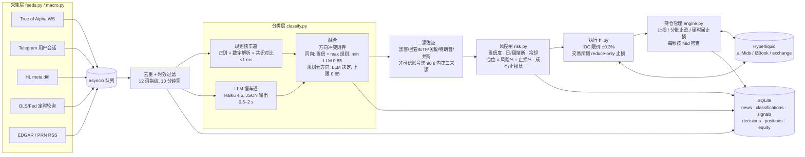

# Hyperliquid 新闻交易永续合约 bot：架构设计与可行性结论

2026-10-01 · 对象：BTC / ETH 永续 + trade.xyz 股票永续（TSLA、NVDA、MU 等）· 新闻源以免费为主 · Python · Mac mini M2 常驻

---

## 0. 先说结论

用免费新闻流做 Hyperliquid 新闻交易，系统可以搭起来并取得正期望，收益来源是新闻后的"二次反应"而非"第一跳"。本周实测 Tree of Alpha 免费 WebSocket 对推特的延迟中位数 0.56 秒，这已经是免费档里最快的，而 CPI 这类定时数据在发布后 15 秒内已走完 5 分钟行情的 85–90%。所以这套系统的设计目标被定为：在新闻发生后 5–60 秒内进场，持有 30 分钟到 2 小时，吃事后延续或事后反转，严格限制单笔风险。

对附加的两个问题，本文第 8、9 节给出数字：

- 最小账户金额：数学下限约 300 USDC，固定成本线约 2,000–3,000 USDC，建议先 paper 2–3 个月再以 1,000–3,000 USDC 上实盘。
- "公开、已验证、年化 200%+"的新闻交易方案：没有找到任何一个同时满足"公开 + 可审计 + 可复现 + 免费数据源"四个条件的。能查到的高收益案例分三种：付费同机房行情 + 上币抢跑（作者本人已宣告失效）、事前建仓（信息优势）、两周样本（nof1 Alpha Arena 冠军 Qwen 两周 +22.9%，下一季四场全亏）。200% 年化在数学上要求每笔交易净赚权益的 0.44%（250 笔/年）或 0.92%（120 笔/年）。按 1.5 倍盈亏比、50% 胜率、250 笔/年做蒙特卡洛：单笔风险 2% 时一年收益中位数 +222%，达到 200% 的概率 57%，最大回撤中位 18%；要把概率提到九成需要单笔风险 4%，代价是最大回撤中位 34%、6% 的路径回撤超过 50%。胜率降到 45% 时，2% 风险的中位收益只剩 +69%。本文给出的是数据能支持的推进路线，没有 200% 的配方。

随附的 `hl-news-bot/` 目录是一套能跑的 paper 模式骨架，已经接通真实新闻流和真实 Hyperliquid 价格，并带事件回测器。

---

## 1. 目标、边界与边际来源

### 1.1 交易什么

| 市场 | 标的 | 最大杠杆 | 维持保证金 | 吃单费（基础档） | 备注 |
|---|---|---|---|---|---|
| 验证者永续 | BTC | 40x | 1.25%（>1.5 亿 U 名义降 20x） | 0.045% | szDecimals 5，价格整数 tick |
| 验证者永续 | ETH | 25x | 2%（>1 亿 U 降 15x） | 0.045% | szDecimals 4 |
| HIP-3 `xyz` | TSLA / NVDA / META / AAPL / MSFT / GOOGL / AMZN | 20x | 2.5% | 0.009%（成长模式）/ 0.09%（标准） | 可全仓 |
| HIP-3 `xyz` | MU / SNDK / SKHX / SKHY | 10x | 5% | 同上 | 可全仓 |
| HIP-3 `xyz` | INTC / PLTR / COIN / HOOD / MSTR / AMD 等 | 10x | 5% | 同上（MSTR 不适用成长模式，0.09%） | 仅逐仓 |
| HIP-3 `xyz` | SP500（50x）、XYZ100（30x）、GOLD/SILVER（25x） | | | | 指数外盘时段跟期货 |

HIP-3 上 trade.xyz 占股票永续成交的约 95–98%，Felix、Ventuals、Kinetiq(USDH)、dreamcash 的部署在 2026 年中已全部下架。API 里的名字固定为 `xyz:TSLA` 形式，资产 ID = 100000 + 10000 × dex 序号 + 序号（`xyz:TSLA` = 110001）。

### 1.2 边际从哪来，从哪不来

用免费源，延迟档位是 0.5–30 秒。据此划分：

能做的：
1. 定时宏观数据的残余行情。CPI 发布后 1 分钟已走完 30 分钟行情的 76%，但剩下 24% 的方向在 83% 的事件里与第一分钟一致。NFP、FOMC 第一分钟只走完 36–38%，但有 23–27% 的概率在 30–60 分钟内翻转，所以模板要更保守。
2. 非计划冲击的延续。Bybit 被盗（14.6 亿美元）从链上被盗到 ZachXBT 公开发帖隔了 64 分钟，发帖后 ETH 5 分钟 −1.36%、15 分钟 −2.65%、30 分钟 −4.07%。特朗普 2025-03-02 储备帖 BTC 第 1 分钟只有 +0.2%，第 5 分钟 +2.3%，第 60 分钟 +4.3%。2025-10-10 关税帖 5 分钟 −1.7%，真正的 −12% 来自 20–30 分钟后的杠杆清算潮。这类事件的"第二跳"持续分钟级，免费源够用。
3. Hyperliquid 自己的新上币（通过 `meta` 接口 diff 发现，零延迟，和所有人同时知道）。
4. HIP-3 股票永续周末内部时段的重新定价（第 2.4 节）。

不做的：
1. 币安 / Upbit 上币抢跑。Binance CMS 接口从数据中心 IP 连发 12 次就 403 并持续 15 分钟以上；Upbit 公告接口对海外 IP 返回 403；付费同机房源每月 200–2,500 美元；研究显示 28–56% 的上币公告前已有内幕建仓，Binance 现货上币 14 天峰值相对首日收盘的中位数只有 +0.9%。这个赛道的边际已被钱和信息优势占满。
2. 毫秒级任何东西。Hyperliquid 自身在 BTC/ETH 价格发现上落后 Binance 约 800 毫秒，IOC 吃单在排序上永远排在同一时刻的撤单和 ALO 挂单之后。
3. 财报后前 10 秒。学术证据（Christensen 等 2025，S&P 500 前 50 名，2008–2020）：按意外符号交易，5 秒延迟后收益 0.41%，10 秒延迟后 0.28% 且不显著，2016–2020 子样本在最优报价上也不显著。xyz 的 MU 在 2026-09-30 财报夜与纳斯达克盘后在同一分钟触底、同一分钟反弹，没有可见的领先或滞后。

---

## 2. 证据：新闻之后价格多快走完

以下数据除标注外均为本次用 Binance 1 分钟 K / aggTrades 自行计算（宏观统计覆盖 2024-01 至 2026-09，个别事件早于此），事件时间取 UTC。

### 2.1 定时宏观

| 事件 | n | +1m | +5m | +15m | +30m | +60m | +4h | 发布分钟成交量 / 前 5 分钟均值 |
|---|---|---|---|---|---|---|---|---|
| CPI（08:30 ET，即 12:30/13:30 UTC） | 32 | 0.47% | 0.46% | 0.50% | 0.48% | 0.65% | 1.40% | 25x |
| NFP | 32 | 0.21% | 0.28% | 0.37% | 0.51% | 0.44% | 1.10% | 16.5x |
| FOMC 声明 | 22 | 0.28% | 0.41% | 0.37% | 0.42% | 0.70% | 0.68% | 7.8x |
| 对照（前一周同一时刻） | 32 | 0.06% | 0.12% | 0.14% | 0.17% | 0.29% | 0.78% | 1.2x |

表中为 BTC 从发布分钟开盘价算起的绝对收益中位数。亚秒级：2025-02-12 CPI 偏热，发布后 5 秒 −0.67%，15 秒 −1.38%，5 分钟 −1.67%。

### 2.2 非计划冲击

| 事件 | 时间锚 | +1m | +5m | +15m | +60m | +24h | 备注 |
|---|---|---|---|---|---|---|---|
| Bybit 被盗，ETH | ZachXBT 发帖 15:20 | −0.14% | −1.36% | −2.65% | −2.46% | −2.83% | 链上 14:16 被盗，64 分钟无人定价 |
| 特朗普加密储备帖，BTC | 15:24 | +0.2% | +2.3% | +3.6% | +4.3% | +7.1% | 约 30 小时后全部回吐 |
| 90 天关税暂停，BTC | 17:18 | −0.66% | +2.21% | +3.89% | +5.20% | +0.75% | 前 30 秒无反应 |
| 100% 对华关税帖 #2，BTC | 20:50 | −0.40% | −1.70% | −2.25%（10m） | −3.2% | −5.6% | 21:13–21:20 清算潮到 −12.7% |
| 假 SEC 推文，BTC | 21:11 | +1.25% | +2.7%（峰值 4m） | −4.2%（14m） | | −1.2% | 辟谣前已开始反转 |
| ETH ETF 概率上调推文 | 19:20 | +0.34% | +4.49% | +7.63% | +9.06% | +18.6% | 真实重定价，无反转 |

结构性结论：非计划冲击的第一个极值通常在发帖后 2–5 分钟出现，免费源 1–20 秒的延迟吃得到；但反转是常态（假 SEC 15 分钟内走完来回，储备帖 30 小时回吐，关税暂停次日回吐），所以持仓窗口必须有硬性时间止损，止盈必须分批。

### 2.3 上币

| 来源 | 数字 |
|---|---|
| IOSG 2025-06，Binance 现货上币 14 天峰值 vs 首日收盘 | 均值 +15%，中位数 +0.9% |
| CoinGecko 2026 CEX 报告（2025-01 至 2026-02） | 上币后短期只有约 32% 上涨；12 个月后 <10% 高于上币价 |
| Ante 2019，327 次上币 | Upbit 上币日 −2.9%（p<0.05），仅 20% 为正 |
| Félez-Viñas 等 2025 | Coinbase 公告前约 250 小时开始提前上涨，28–48% 的上币有内幕交易特征 |
| 2025 年 Upbit 公告反应 | CAP 1 分钟内 +34.5%，BIGTIME 1 分钟 +35% |

上币的钱在前 1–60 秒，并且做这件事的人用的是 Tokyo/Seoul 同机房接入。这不是本系统的目标。

### 2.4 美股与 HIP-3 股票永续

盘后价格发现：财报日 80% 的全天价格发现发生在 16:00–18:30 盘后时段，其中约 70% 在前 5 分钟完成（Christensen, Timmermann & Veliyev 2025）。xyz 的外部定价在周日 20:00 ET 到周五 20:00 ET 之间 24/5 覆盖盘前、盘中、盘后以及 Blue Ocean ATS 的夜盘（20:00–04:00），所以财报夜 xyz 永续跟着盘后成交走，不存在"永续先动"的结构性窗口。

周末内部时段是唯一结构性独特的窗口：周五 20:00 ET 到周日 20:00 ET，预言机由永续自己订单簿的冲击价差驱动的 EMA（时间常数 30 分钟）推进，标记价被限制在参考价 ±(1/最大杠杆) 的发现边界内（TSLA/NVDA ±5%，MU ±10%，SP500 ±2%），可重锚 0–2 次。

| 来源 | 周末最终价比周五收盘更接近周一开盘参考价的比例 |
|---|---|
| Messari 2026-08，614 个市场-周末，跨资产 | 70.7%；周一开盘变动 >100 bps 时 86%，<25 bps 时 31% |
| Hyperliquid Research Collective，23 个股票市场 191 个周末 | 50.7%，中位改善 0.4 bps；周末挂单深度为工作日 33.9% |
| Crypto.com Research，52 周 | 周日 22:00 方向准确率 NVDA 78.9%、TSLA 52.6%；但周日夜对冲 P&L 为负 |

含义：单只股票的周末定价整体与周五收盘打平，只有当周末真有 >50–100 bps 的新闻时永续才明显领先。这正好是新闻 bot 能用的：周末出现针对某只股票的重大新闻时，在周日 20:00 ET 外部定价恢复前进场，赌重新开盘的缺口。风险是发现边界（±5%）可能把永续钉在真实缺口之下，以及 SK 海力士 2026-07-27 事件：一笔稀薄的韩股盘前成交被中继进预言机，标记价 −18.4%，预言机更新后 2.7 秒开始清算，一分钟内清算 5,180 万美元。

### 2.5 Hyperliquid 执行面的事实

| 项目 | 实测/文档 |
|---|---|
| BTC 永续点差 / 顶档 | 0.12 bps（$1 tick）/ $30–90 万 |
| BTC ±0.1% 深度每侧 | $1,800–2,300 万；$1M 市价单滑点 0.6–2.1 bps，$10M 2.5–4.3 bps |
| ETH ±0.1% 深度每侧 | $900–1,000 万；$1M 滑点 1.9–4.1 bps |
| xyz:TSLA ±10 bps 深度（本次实测） | 买侧 $29.5 万 / 卖侧 $26.4 万 |
| 端到端延迟（官方，同地） | 中位 0.2 秒，p99 0.9 秒；区块约 70–80 ms |
| 本机到 API RTT（深圳经代理） | 0.30–0.51 秒 |
| 2025-10-10 极端行情 | HL BTC 比 Binance 永续多插 0.7%，ETH 多插 4.7%；CEX 可见深度跌 98%；标记价含 150 秒 EMA，清算/止损触发价滞后于盘口 |
| 排序规则 | 同一时刻发出的撤单和 ALO 几乎总在 IOC/GTC 之前成交 |
| 市价单 | 实为 IOC 限价；SDK 默认滑点容忍 5%（必须收紧） |
| 每周升级 | 周五 08:00–09:30 UTC 有 9–20 分钟只挂单窗口，市价单不成交 |

---

## 3. 信息流分层与延迟预算

### 3.1 可用源（2026-10-01 全部实测过）

| 层 | 源 | 接入 | 费用 | 相对原始事件的延迟 | 用途 |
|---|---|---|---|---|---|
| T0 | Tree of Alpha 主 WS `wss://news.treeofalpha.com/ws` | WebSocket，无需登录 | 免费（付费档解锁交易所公告专线） | 推特中位 0.56 s，p90 1.0 s；Binance EN 1.26 s；推送 Truth Social `type: direct` | 主力：推特、博客、usGov、Truth Social |
| T0 | @BWEnews Telegram | Telethon 用户会话 | 免费 | 约 2 s（含币安公告中继） | 上币/交易所公告中继，中英双语 |
| T0 | @CLWfeed Telegram / cryptolisting.ws FreeDelayed | Telegram 或 WS key | 免费（+240 ms 档） | 约 1 s | Upbit/Bithumb/Robinhood 公告，海外唯一稳定渠道 |
| T0 | Hyperliquid `meta` / `perpDexs` diff | REST 轮询 5 s | 免费 | 0（和所有人同步） | HL 新上币 |
| T0 | Polymarket CLOB WS | WebSocket | 免费 | 秒级 | 宏观/政治事件的事前共识 |
| T1 | bls.gov 发布页 / Fed 新闻稿 URL 定时轮询 | REST，需带联系方式的 UA | 免费 | 1–3 s | CPI/NFP 数字本身（解析器已实现并对当前页面验证）；FOMC 声明轮询未实现 |
| T1 | SEC EDGAR `getcurrent` Atom（8-K） | REST，≤10 req/s | 免费 | 秒级到 1 分钟 | 财报 8-K Item 2.02、重大协议 1.01 |
| T1 | PR Newswire RSS | REST 5–10 s | 免费 | <30 s | 公司新闻稿（Business Wire 公共 RSS 已停） |
| T1 | Bybit / OKX 公告 API | REST 1–2 s | 免费 | OKX 比排定时间晚约 12 s 发布 | 交易所公告备份 |
| T2 | trumpstruth.org RSS | REST | 免费 | 分钟级 | 仅作上下文（官方 Truth API 月费 10 万美元） |
| T2 | X API 过滤流 | 按读计费 $0.005/条 | 约 $90/月（30 账号） | P99 4–5 s | 比 ToA 慢且贵，不推荐 |
| 辅 | ForexFactory 周历 JSON | REST，缓存 60 s | 免费 | 只有预期值，无实际值 | 宏观共识（已实现） |
| 辅 | Claude Haiku 4.5 / GPT-5 nano | API | 每千条 $0.25–0.48 / $0.04 | 首 token 0.6 s，整体 0.5–2 s | 慢车道解读 |

被排除的：Binance CMS 直连（WAF 封 15 分钟以上）、Upbit 公告 API 直连（海外 403，官方 WS 需韩国 KYC）、Investing.com（Cloudflare）、Alpha Vantage（每日 25 次）、Whale Alert（无免费 API）、Phoenix News（价格不公开）。

### 3.2 延迟预算

```mermaid
gantt
    title 一条非计划新闻从发生到我方成交（典型，毫秒）
    dateFormat x
    axisFormat %Q
    section 外部
    事件发生到源发布（推特/博客）        :a1, 0, 560
    section 本机
    WS 接收 + 解析 + 去重                 :a2, 560, 580
    规则快车道（正则/数字）               :a3, 580, 582
    LLM 慢车道（可选，仅规则不确定时串行）  :a4, 582, 1800
    盘口拉取 + 滑点估计 + 风控            :a5, 582, 1000
    section Hyperliquid
    IOC 下单往返（深圳→API）              :a6, 1000, 1500
    区块确认                              :a7, 1500, 1700
```

规则车道走完全程约 1.7 秒（受本机到 API 的 0.3–0.5 秒 RTT 支配）；规则低于门槛时串行调用 LLM，全程约 2.5–3.5 秒，等待期间并行刷新一次行情。两者都远慢于 CPI 的 15 秒走完 85%，但都快于非计划冲击 2–5 分钟的第一个极值。若将来追求 T0 事件，把执行进程搬到东京 VPS 可省 0.3–0.4 秒，但新闻源本身的 0.5–2 秒不会变，所以此项优先级靠后。

---

## 4. 总体架构

### 4.1 采集层

每个源是一个 `async generator`，产出统一的 `NewsItem`（来源、子频道、账号、标题、原始时间戳、本机接收时间、源给出的币种建议）。Tree of Alpha 的 REST 历史接口和 WS 推送的消息结构不同（WS 的 Truth Social / 推特直推是 `{title: "Name (@handle)", body, link, type: "direct", info{twitterId, truthId}}`，没有 `source` 字段），解析器两种都处理，这是本周实跑时踩到并修掉的。所有源的 WS 断线按指数退避重连（Hyperliquid 官方 SDK 的 WebSocket 管理器没有重连逻辑，这里的行情走 REST 轮询加自己的重连）。

时效过滤在引擎入口对所有实时源统一做：原始时间戳距今超过 20 秒的直接丢，避免重连后补发的旧消息触发交易（回放源除外）。

### 4.2 去重与佐证

同一条新闻会从推特、博客、Telegram 以 3–8 个版本在几十秒内到达。指纹取标题小写、去链接、去 "Name (@handle):" 前缀、去标点后的前 12 个词做 SHA1，10 分钟窗口内相同指纹只处理第一条。

佐证器按（事件类、币种、方向）记录 90 秒内不同来源的数量。黑客、监管、ETF、关税、特朗普、并购这六类，若首发账号不在可信名单（DeItaone、FirstSquawk、WatcherGuru、unusual_whales、CoinbaseMarkets、SECGov、zachxbt、PeckShieldAlert 等）则必须等到第二个独立来源。假 SEC 推文那种单点来源会被这一层挡住一次，由"辟谣反转"规则再挡一次。

### 4.3 分类层：双车道

规则快车道只处理窄而确定的事：CPI/NFP/FOMC 数字与共识的差值（共识由宏观调度器在发布前 15 分钟从 ForexFactory 注入，或直接解析 FirstSquawk 格式里的 FORECAST 值）、黑客金额与涉事交易所、ETF 批准/否决/辟谣、关税升级/缓和、财报 beat/miss 与指引上调/下调。每条规则输出事件类、方向、置信度、标的、是否谣言、是否定时事件。规则车道的置信度上限按来源分两档：可信账号或官方/通讯社来源 0.80–0.85，其余 0.60。对照第 5 节的门槛，这意味着在不开 LLM 的默认配置下，只有可信来源的黑客/关税/特朗普/财报类、BLS 直采的 CPI/NFP 和 HL 新上币能直接下单，ETF/监管/脱锚类（门槛 0.85）必须经 LLM 车道确认。本周用过去 168 小时的 2,597 条真实新闻跑这条车道：0 条达到直接下单门槛，49 条进入"需要慢车道复核"状态。这个结果一半来自门槛结构，一半来自这一周没有发生可信来源首发的重大事件，不能当作精度证据；精度要靠 paper 期间人工复核 decisions 表得到。

LLM 慢车道在规则给出"无方向"或置信度低于该事件类门槛时串行调用（同时刷新一次行情），用一个 250 token 的系统提示和严格 JSON 输出（事件类、方向、置信度、标的、是否谣言、12 词理由）。融合策略：两车道方向冲突则放弃；规则有方向且 LLM 同向则置信提到 max(规则, min(LLM, 0.85))；规则无方向时采用 LLM 结论但置信封顶 0.85。LLM 永远不能单独把一条新闻推过"可信账号"门槛。

为什么不全靠 LLM：nof1 Alpha Arena 第一季六个模型在 Hyperliquid 上实盘两周，四个亏超过 50%，整体跑输持有 BTC；1.5 季加入新闻源的那一组七个模型中六个为负；学术上 Lopez-Lira 等人的标题策略夏普从 2021 年的 6.5 衰减到 2024 年的 1.2，且在 20 bps 往返成本下不盈利，另有研究估计 LLM 表观预测力的约 37% 来自记忆。LLM 在这里的职责是把"规则没覆盖的措辞"翻译成结构化字段，价格方向的判断仍由模板和历史统计承担。

### 4.4 风控闸

纯函数：输入信号、模板、账户状态、盘口滑点估计，输出接受/拒绝和仓位。拒绝原因全部落库，这是日后调参的主要数据。顺序：是否熔断 → 有无方向 → 置信度 ≥ 模板门槛 → 日亏 ≥3% 或周亏 ≥6% 则停 → 亏损后 15 分钟冷却 → 同币种 10 分钟冷却 → 最多 2 个持仓 → 同币不加仓 → 往返成本（2× 手续费 + 2× 滑点估计）不得超过止损距离的 35% → 仓位 = 权益 × 风险% ÷ 止损%，再被单笔名义上限、模板杠杆上限、币种最大杠杆、总杠杆 3x 四重封顶 → 名义 <12 U 拒绝（交易所最小 10 U）。

### 4.5 执行与持仓

进场用 IOC 限价，价格为 mid ±0.3%（SDK 默认 5%，在 10-10 那种盘口里会以远差于预期的价格成交）。成交后立刻在交易所侧挂 reduce-only 触发止损（`tpsl: "sl"`，`isMarket: true`，触发价参照标记价），时间止损和止盈由本地每秒检查执行。下单前按模板杠杆上限调用 `update_leverage`：BTC/ETH 用全仓（保证金共享，两个持仓可以并存），HIP-3 中 `onlyIsolated` / `noCross` 的标的强制逐仓，其余 HIP-3 标的也用逐仓。交易所侧的杠杆是保证金杠杆，与风控里"名义/权益"的比例是两个量，日志里分开打印。平仓前先撤该币种所有挂单再 `market_close`。

Paper 模式用同一份代码路径，差别只在 `open_position` / `close_position`：按当前 l2Book 逐档吃单估算滑点、按基础档吃单费扣费。

### 4.6 宏观调度器

一天解析一次 BLS 日程页（已验证解析出 10-02 NFP、10-14 CPI）。发布前 15 分钟拉 ForexFactory 共识并注入规则上下文；发布前 2 秒开始以 0.7 秒间隔轮询 `bls.gov/news.release/cpi.nr0.htm`，页面内容相对发布前基线发生变化即解析数字（解析器已对当前页面验证：CPI 同比 3.4、核心 2.4，NFP +162k），生成一条 `usGov` 频道的 NewsItem 进入同一条管线。请求头必须带可联系的 User-Agent，BLS 会封匿名高频客户端。

---

## 5. 事件类与交易模板

| 事件类 | 触发条件（规则车道） | 方向逻辑 | 持有 | 止损 | 止盈 | 单笔风险 | 杠杆上限 | 置信门槛 | 证据基础 |
|---|---|---|---|---|---|---|---|---|---|
| macro_cpi | 解析出实际值且有共识；\|总体差 + 核心差\| ≥0.1pp | 偏热做空 BTC/ETH，偏冷做多 | 30 min | 0.8% | 1.2% | 0.5% | 3x | 0.80 | 2.1 节；回测见 10.2 |
| macro_nfp | 差值 ≥50k | 强于预期做空 | 60 min | 0.9% | 1.2% | 0.4% | 2x | 0.80 | 第一分钟仅走完 36%，翻转 23% |
| macro_fomc | 决议与预期 bps 不同 | 更鸽做多 | 60 min | 1.0% | 1.2% | 0.4% | 2x | 0.80 | 翻转率高，2025 年 8 次会后 7 次 48h 内为负 |
| hack_exploit | 金额 ≥1 亿美元或涉及头部交易所；排除"追踪/洗钱/恢复/复盘"类跟进报道 | 做空 BTC/ETH（或被点名币种） | 90 min | 1.5% | 2.5% | 0.8% | 3x | 0.80（可信源）| Bybit 案例 30 分钟 −4% |
| depeg | 稳定币脱锚措辞 | 做空 | 90 min | 1.5% | 2.5% | 0.6% | 2x | 0.85 | USDC 2023 为慢跌 4 小时 |
| etf | 批准/否决；"账号被盗/未批准"视为反转 | 批准做多，否决或辟谣做空 | 60 min | 1.5% | 2.0% | 0.5% | 2x | 0.85 | 真批准常为利好出尽 |
| regulatory | SEC/DOJ 起诉、禁令 | 做空 | 60 min | 1.5% | 2.0% | 0.5% | 2x | 0.85 | |
| tariff | 暂停/豁免/协议做多；加征/报复做空 | | 60 min | 1.5% | 2.5% | 0.6% | 2x | 0.80 | 2.2 节 |
| trump_policy | 本人账号或可信中继账号引述，且含加密政策措辞；转发忽略 | 储备/行政令做多，禁令/税做空 | 60 min | 1.5% | 2.5% | 0.6% | 2x | 0.80 | 本人账号 + 一个可信中继即满足二源 |
| listing_hl | `meta` universe 出现新名字 | 等 3 秒看首批成交方向再顺势 | 10 min | 3.0% | 4.0% | 0.3% | 2x | 0.90 | 无公开研究，纯动量假设，仓位最小 |
| earnings / guidance | 金融来源 + 标的在 universe + beat/miss 或 raise/cut 措辞无歧义 | 顺意外方向 | 120 min | 2.0% | 3.0% | 0.6% | 3x | 0.80 | 2.4 节；前 10 秒无边际，赌漂移 |
| m_and_a | 收购措辞 | 规则给不出收购方/标的方向；无模板，LLM 输出仅记录不交易 | | | | | | | |

置信门槛列与规则车道的置信上限对照：可信来源命中给 0.80（CPI 0.85，HL 上币 0.90），非可信来源 0.60。门槛 0.85 的类（ETF、监管、脱锚）在默认配置下只能经 LLM 车道达到。止盈写的是单一目标，实现时建议改为 TP1 减仓一半并移保本（这是你在 HYPE 杠杆标尺那套里已经在用的框架）。

---

## 6. 风控：参数之外的部分

账户层：日亏 3% 停开新仓到 UTC 零点，周亏 6% 停到下周；连续亏损后冷却；价格源超过 15 秒未更新时拒绝新信号；连续 3 次下单失败则熔断停开新仓；已有仓位保留交易所侧止损。新闻 WS 断线只影响信号来源，持仓管理不受影响。

Hyperliquid 特有的几件事要写进代码而不是写进备忘录：

1. 标记价与盘口脱节。标记价含 150 秒 EMA 项，强平和触发单按标记价。极端行情里盘口已经穿过止损价但标记价没到，止损不触发，所以本地按 mid 的时间/价格检查是必须的第二道。
2. 发现边界。股票永续周末标记价被钉在 ±(1/杠杆) 内，清算价在边界外的仓位在边界激活期间无法被清算，重新开盘时一次性兑现。周末持仓的止损要按"周一缺口"而不是"周末盘口"来想。
3. OI 上限。xyz 每币种有名义上限（AAPL 2 亿、AMZN/AMD 1 亿等），触顶时下单返回 `PositionIncreaseAtOpenInterestCap`，视为拒单不重试。
4. 升级窗口。周五 08:00–09:30 UTC 的只挂单窗口里 IOC 不成交，持仓的止损也不会市价成交。要么周五该时段前平掉，要么用限价止损。
5. 排序劣势。IOC 排在撤单之后，意味着新闻瞬间盘口撤单先于你的吃单，实际成交价比看到的差。paper 模式的滑点估计偏乐观，实盘前两周要对比 `userFills` 的实际成交价。
6. ADL。2025-10-10 HL 在 12 分钟内执行 34,983 次自动减仓，盈利方被强制平仓。做对方向也可能被提前平掉。

---

## 7. Hyperliquid 执行细节

API 钱包：在 app.hyperliquid.xyz/API 或用 `Exchange.approve_agent()` 创建，只能签单不能提币，最多 1 个未命名 + 3 个命名，有效期最长 180 天。`/info` 查询永远用主地址。一个进程一个 API 钱包：官方 SDK 用毫秒时间戳当 nonce，没有原子计数器，同一毫秒两次调用或两个进程共用一个 key 会撞；nonce 规则是"每个签名者保留最高的 100 个 nonce，新 nonce 必须大于其中最小值且未用过"，窗口 (T−2 天, T+1 天)。

下单：`{"type":"order","orders":[{a,b,p,s,r,t:{limit:{tif:"Ioc"}}}],"grouping":"na"}`，价格 ≤5 位有效数字且小数位 ≤6−szDecimals（BTC 在 8 万价位上是整数 tick），数量按 szDecimals 截断，SDK 的 `float_to_wire` 对舍入误差直接抛异常，所以要先自己 round。止损用 trigger 订单 reduce-only。`scheduleCancel` 是死人开关（≥5 秒后撤全部，每日 10 次），进程崩溃时有用。

HIP-3：`Info(perp_dexs=["", "xyz"])` 必须显式传，否则 `name_to_asset("xyz:TSLA")` 抛 KeyError（SDK issue #281）。标准账户模式下每个 dex 独立余额，用 `send_asset(source_dex, destination_dex)` 转，权益 = 各 dex `clearinghouseState` 之和；统一账户模式一份 USDC 覆盖全部但每日 5 万次操作上限，此时各 dex 单独状态无意义，只读主状态。代码用 `hyperliquid.unified_account` 开关区分，默认标准模式。`meta_and_asset_ctxs()`、`user_fills()` 等几个方法还不接受 `dex` 参数，需要直接 POST。

限速：IP 1,200 权重/分钟（`l2Book`/`allMids` 权重 2，其余 info 20，`candleSnapshot` 每 60 根加权重）；地址级每累计成交 1 USDC 换 1 次操作，初始 10,000 次缓冲，撤单额外有 `min(limit+100000, 2×limit)` 保底；WS 每 IP 10 连接、1,000 订阅、2,000 消息/分钟。本机实测连续 POST 间隔 1.5 秒不触发 429。

费用：BTC/ETH 吃单 0.045%，推荐码 4% 折扣；xyz 成长模式 0.009%（129 个标的中 118 个开启；GOLD、MSTR 等 11 个不适用），标准 0.09%。止损 0.3% 时 BTC/ETH 往返成本（费 + 2 bps 滑点）占止损距离 43%，止损 1% 时 13%，这是模板止损都 ≥0.8% 的原因。

测试网：`api.hyperliquid-testnet.xyz`，水龙头 1,000 测试 USDC 要求同地址在主网有过存款；xyz 在测试网存在（dex 序号 65，约 70 个标的，极薄），资产 ID 与主网不同，代码按名字解析。

---

## 8. 最小账户金额

三条线分开算。

数学下限约 300 USDC。交易所最小单 10 U；单笔风险 1%、止损 1% 时名义 = 权益，风险 0.5%、止损 1.5% 时名义 = 权益 × 1/3，所以 300 U 的账户在最保守模板下单笔名义 100 U，仍在最小单之上。BTC 最小数量 0.00001（约 0.8 U）、TSLA 0.001（约 0.36 U），不构成约束。地址级限速 10,000 次初始缓冲对每年百笔级别的策略足够。

固定成本线约 2,000–3,000 USDC。免费源 + Mac mini 的边际成本接近零，LLM 慢车道在前置正则过滤后每月 10–40 美元。要让固定成本低于权益的 10%/年，权益需在 2,000 U 以上。若将来加 cryptolisting.ws Basic（200 U/月）之类的付费源，这条线会抬到 2 万 U 以上，这也是"免费为主"路线的内在约束。

统计学费线：真正的约束。区分 60% 胜率和 50% 胜率（单边 95% 置信、80% 功效）约需 150 笔；区分 55% 和 50% 约需 600 笔。按第 5 节的事件频率（CPI 12 + NFP 12 + FOMC 8 + 非计划冲击 10–20 + HL 上币若干 + 财报季每季 7 只 × 1 次），一年高置信信号大约 60–120 个，所以头一年的样本靠 paper 积累而不是靠真钱。实盘的意义是校准滑点和执行，不是验证边际。按 1% 单笔风险、1.5 倍盈亏比、150 笔，若策略实际胜率只有 35%，期望亏损约 −19%，即 2,000 U 账户的"学费"约 400 U。

建议：paper ≥2–3 个月或 ≥60 个信号 → 测试网跑通下单路径 → 1,000–3,000 USDC 实盘，单笔风险 0.5–1%，≥100 笔实盘且期望为正后才按权益比例放大。这笔钱按"可以全部亏掉"来准备。

---

## 9. 关于"公开、已验证、年化 200%+"的方案

### 9.1 查到了什么

我用三个方向去找：学术与机构研究、开源项目与作者自述、实盘竞赛与链上可查的账户。

学术与机构研究里没有任何一个免费数据源的新闻策略给出可审计的 200% 年化。最接近的是 Lopez-Lira & Tang 的 ChatGPT 标题策略（4,123 家公司，2021-10 至 2024-05）：次日漂移命中率 58%、每日 34 bps、税前夏普 2.97，但换手率 190%/天，在 20 bps 往返成本下不盈利，且夏普逐年从 6.54 衰减到 1.22；收益主要来自空头和小盘股，而有永续合约的标的都不是小盘股。

开源项目里，所有千星以上的新闻/上币 bot 都在 2021–2023 年停更，apebot 作者（1,506 星）自述边际 2022 年已消失，"0.1 秒都太晚"；cryptomaton 的 bot 迭代到第五版改成在上币瞬间卖出而不是买入。2025–2026 年与本设计最接近的 wongtp/llmnewsarena 是 0 星单人项目，默认 dry-run，无实盘记录。

实盘竞赛：nof1 Alpha Arena 第一季（2025-10-17 至 11-03，六个模型各 1 万美元在 Hyperliquid 实盘），Qwen3-Max 两周 +22.9%（峰值 +109%，最大回撤 56%，43 笔，胜率 30%）；1.5 季四场比赛 Qwen 全部亏损（−6.8% 到 −82.1%），加入新闻源的那场七个模型六个为负。nof1 官网现在的表述是"当前一代 LLM 在金融市场表现极差，版本之间几乎没有改善"。

链上可查的"高收益"：2025-03-02 储备帖前 35 分钟建仓 2 亿美元 50 倍多单的钱包赚约 680–700 万（3.4%）；2025-10-10 关税帖前一天建仓约 11 亿美元空单的地址据报获利 1.6–2 亿；2026-09 HAJIMI 上币一台 bot 付 3.1 万手续费赚 37.8 万。前两个是事前信息，第三个是付费同机房 + 抢排队，都不是可复现的策略。

### 9.2 数学上 200% 意味着什么

年化 200% = 权益翻三倍，每笔需要的对数增长 = ln 3 / 年交易数：250 笔/年每笔 0.44%，120 笔/年每笔 0.92%，400 笔/年每笔 0.27%。按 1.5 倍盈亏比、每笔承担权益 f 的风险、250 笔做 2 万条路径的蒙特卡洛：

| 胜率 | 单笔风险 | 一年收益 p10 / p50 / p90 | 最大回撤中位 | P(回撤 ≥50%) | P(≥+200%) |
|---|---|---|---|---|---|
| 40% | 2% | −44% / −7% / +53% | 36% | 17% | 0.1% |
| 40% | 4% | −72% / −26% / +100% | 62% | 78% | 2.9% |
| 45% | 2% | +3% / +69% / +192% | 24% | 0.9% | 8% |
| 45% | 4% | −9% / +144% / +626% | 44% | 32% | 40% |
| 50% | 2% | +96% / +222% / +430% | 18% | 0% | 57% |
| 50% | 4% | +229% / +785% / +2285% | 34% | 6% | 91% |

200% 的前提是"1.5 倍盈亏比下 ≥50% 的胜率，并且每年 250 次机会"。本次用理想分类（事后已知意外方向）回测 2024-01 至 2025-08 的 16 次有意外的 CPI 发布 × BTC/ETH = 32 笔：20 秒延迟进场胜率 53%，每笔均值 +0.10%，合计 3.96 R，按 1% 风险是约 20 个月 +4%；延迟 5 秒胜率 66%、+0.21%；60 秒后归零；180 秒后为负。也就是说，即便方向全对，CPI 这一类在免费延迟下的每笔期望是止损距离的 1/8，离 0.44% 权益/笔差一个数量级。13 个非计划冲击事件 20 秒延迟 100% 胜率、均值约 +2%，但这 13 个是事后挑出来的著名事件，样本偏差决定了这个数字只能说明"模板在这些事件上不会被止损打掉"，不能说明胜率。

### 9.3 数据支持的推进路线

把 200% 当成目标会把单笔风险推到 4%，蒙特卡洛显示那是 1/3 到 3/4 的概率腰斩。可推进的是：先用 0.5–1% 风险把第 5 节的模板跑出 100+ 笔真实样本，确认哪几类有正期望；只给确认有正期望的类别逐步加风险到 2%；若最终胜率落在 45–50%、年机会 150–250 次，中位收益在 +30% 到 +120% 之间，这是数据支持的区间。周末 HIP-3 新闻缺口模块（第 2.4 节，仅在周末新闻 >100 bps 时触发，Messari 样本中该子集 86% 更接近周一开盘价）是最有可能把胜率拉高的增量，但年机会数只有个位数到十几次。

---

## 10. 验证路线

### 10.1 三阶段门槛

| 阶段 | 做什么 | 通过条件 |
|---|---|---|
| Paper（已可运行） | 真实新闻流 + 真实价格 + 本地模拟成交；每天看 `decisions` 表里的拒绝原因分布 | ≥60 个信号；按事件类统计胜率、R 倍数、时间止损占比；规则误报率（人工复核 decisions）<10% |
| Testnet | `network: testnet`，走真实下单路径；验证 nonce、舍入、止损触发、HIP-3 逐仓、`send_asset` | 100 笔下单无异常；paper 成交价与 testnet 成交价偏差有记录 |
| Live 小仓 | 1,000–3,000 U，风险 0.5%；对比 `userFills` 实际成交与 paper 滑点估计 | ≥100 笔，期望为正，实际滑点在估计 2 倍以内 |

### 10.2 事件回测器

`hlnews/backtest.py` 读 `data/events.jsonl`（时间、币、方向、事件类），拉 Binance 1 分钟 K，按模板模拟进场延迟、止损、止盈、时间止损，扣基础档手续费和 2 bps 滑点，输出按类统计和延迟扫描。它的用途是测模板参数对延迟的敏感性；方向是事后给的，所以它不能估计胜率。要估计胜率必须用 paper 期间规则车道实际产出的方向。

本次结果（CPI，16 次发布 × 2 标的 = 32 笔，方向事后已知）：

| 进场延迟 | 胜率 | 每笔均值 | 中位 |
|---|---|---|---|
| 5 s | 66% | +0.21% | +0.29% |
| 20 s | 53% | +0.10% | +0.15% |
| 60 s | 47% | 0.00% | −0.06% |
| 180 s | 34% | −0.13% | −0.15% |
| 300 s | 31% | −0.01% | −0.19% |

结论直接写进了模板：CPI 只在 BLS 直采路径（1–3 秒）下交易，若只能从中继源拿到数字（通常 5–20 秒）则把 CPI 模板的风险降半或关掉。

---

## 11. 部署

Mac mini M2 作为常驻主机：`launchd` 用户代理 `KeepAlive`，工作目录放在 `~/hl-news-bot`，日志走 `data/hlnews.log` + 系统 `log stream`。网络经你的 Clash 代理出网，实测到 HL API RTT 0.3–0.5 秒，Tree of Alpha WS 和 BLS 均可直达。进程只持有 API 钱包私钥，主钱包私钥不进这台机器；私钥放 Keychain 或环境变量文件（`chmod 600`），不进 git。

监控三件事：WS 最近一条消息距今（>120 秒告警）、价格源最近更新距今（>15 秒自动停开新仓）、当日已实现盈亏（触及 −3% 自动熔断）。告警走 Telegram bot 推送到你手机（这里 Bot API 可用，因为是发不是读）。

每周五 08:00–09:30 UTC 升级窗口：引擎在窗口前 5 分钟平掉全部持仓，窗口内不开新仓（`maintenance_window` 配置，时段按官方公告调整）。

本地 LLM 备选：8 GB 的 M2 跑 3–4B 量化模型约 25–35 tok/s，一条分类 3–5 秒，比云端慢且准确率低，只作云端 API 不可用时的降级，不作主路径。

---

## 12. 失败模式清单

| 失败模式 | 已有防线 | 残余风险 |
|---|---|---|
| 假新闻（假 SEC、假关税暂停） | 二源佐证；辟谣反转规则；谣言词过滤；硬时间止损 | 两个"可信"账号同时转发假消息（2025-04-07 案例经 DeItaone → CNBC → Reuters） |
| 旧闻重发 / 重连补发 | 入口 20 秒时效过滤；10 分钟指纹去重 | 源时间戳本身错误 |
| 跟进报道被当成新事件（"黑客开始转移赃款"） | 跟进措辞过滤 | 措辞覆盖不全，需按 paper 期间的误报持续补 |
| 规则方向写反（如 NFP 强 = 风险偏好下降的假设在某些宏观 regime 下反转） | 置信门槛；按类统计后关掉负期望类 | 需要 ≥30 笔/类才能看出来 |
| 标记价滞后导致止损不触发 | 本地按 mid 的二道检查 | 本机断网时只剩交易所侧止损 |
| 10-10 式流动性真空 | IOC ±0.3% 限价不追；成本/止损比门槛拒单 | 已有仓位的止损市价单成交价远差于触发价 |
| ADL 把盈利仓位平掉 | 无 | 接受 |
| HIP-3 预言机中继错误（SKHX 式） | 股票永续杠杆 ≤3x；周末持仓用缺口思维设止损 | 2.7 秒内被清算，止损来不及 |
| OI 上限拒单 | 识别错误码不重试 | 错过信号 |
| nonce 冲突 | 单进程单 API 钱包 | 多实例误启 |
| 升级窗口 | 窗口前 5 分钟自动平仓，窗口内不开仓 | 临时公告的升级；时段变更需手动改配置 |
| 过拟合回测 | 回测只用于参数敏感性，胜率只信 paper/live 样本 | 调参时仍会不自觉地按回测结果改模板 |

---

## 13. 已交付代码与下一步

`hl-news-bot/` 已实现并在本机验证：Tree of Alpha WS 接入（两种消息结构）、HL 新上币探测、BLS 日程/共识/发布秒级轮询与解析、规则快车道、LLM 慢车道接口、融合、二源佐证、风控闸、paper 执行（按 l2Book 估滑点）、live 执行路径（IOC + 交易所侧止损）、SQLite 落库、回放、事件回测器。14 条回放标题全部按预期分类；过去一周 2,597 条真实新闻 0 条触发下单、49 条进入待复核。

下一步按优先级：

1. 跑 paper 两到三个月，每周看 `decisions` 表，补规则的跟进词表与可信账号名单。
2. 接 Telegram（@BWEnews、@CLWfeed）作为第二来源，提高佐证通过率。
3. 加周末 HIP-3 缺口模块：周六/周日对 universe 内股票的新闻单独建模板，周日 20:00 ET 前进场。
4. 加 EDGAR 8-K 轮询（财报 Item 2.02）作为 earnings 类的主来源，PR Newswire 作为次来源。
5. 止盈改为 TP1 减半 + 移保本。
6. 以上跑完再决定是否值得为 T0 事件搬东京 VPS 或买付费源。

---

## 参考来源

Hyperliquid 官方文档：[Exchange endpoint](https://hyperliquid.gitbook.io/hyperliquid-docs/for-developers/api/exchange-endpoint) · [Nonces and API wallets](https://hyperliquid.gitbook.io/hyperliquid-docs/for-developers/api/nonces-and-api-wallets) · [Rate limits](https://hyperliquid.gitbook.io/hyperliquid-docs/for-developers/api/rate-limits-and-user-limits) · [WebSocket subscriptions](https://hyperliquid.gitbook.io/hyperliquid-docs/for-developers/api/websocket/subscriptions) · [Tick and lot size](https://hyperliquid.gitbook.io/hyperliquid-docs/for-developers/api/tick-and-lot-size) · [Asset IDs](https://hyperliquid.gitbook.io/hyperliquid-docs/for-developers/api/asset-ids) · [Margin tiers](https://hyperliquid.gitbook.io/hyperliquid-docs/trading/margin-tiers) · [Fees](https://hyperliquid.gitbook.io/hyperliquid-docs/trading/fees) · [Optimizing latency](https://hyperliquid.gitbook.io/hyperliquid-docs/for-developers/api/optimizing-latency) · [HIP-3](https://hyperliquid.gitbook.io/hyperliquid-docs/hyperliquid-improvement-proposals-hips/hip-3-builder-deployed-perpetuals) · [Testnet faucet](https://hyperliquid.gitbook.io/hyperliquid-docs/onboarding/testnet-faucet) · [Python SDK](https://github.com/hyperliquid-dex/hyperliquid-python-sdk)（issues #191 #281 #287）

trade.xyz 文档：[Oracle price](https://docs.trade.xyz/perpetuals/mechanics/oracle-price) · [External price](https://docs.trade.xyz/perpetuals/mechanics/external-price) · [Discovery bounds](https://docs.trade.xyz/perpetuals/mechanics/discovery-bounds) · [Fees](https://docs.trade.xyz/perpetuals/mechanics/fees) · [US stocks sessions](https://docs.trade.xyz/perpetuals/markets/stocks/us)

新闻源：[Tree of Alpha docs](https://docs.treeofalpha.com/websockets) · [BWEnews WS 公告](https://x.com/bwenews/status/1915350326905115039) · [cryptolisting.ws pricing](https://cryptolisting.ws/pricing/) · [Upbit announcement WebSocket](https://docs.upbit.com/kr/reference/websocket-announcement) · [BLS API v2](https://www.bls.gov/developers/api_signature_v2.htm) · [BLS CPI schedule](https://www.bls.gov/schedule/news_release/cpi.htm) · [Fed press RSS](https://www.federalreserve.gov/feeds/press_monetary.xml) · [ForexFactory JSON](https://nfs.faireconomy.media/ff_calendar_thisweek.json) · [SEC developer resources](https://www.sec.gov/about/developer-resources) · [X API pricing](https://docs.x.com/x-api/getting-started/pricing) · [Truth Social API（CNBC）](https://www.cnbc.com/2026/07/16/trump-truth-social-wall-street-traders-api.html) · [Polymarket WS](https://docs.polymarket.com/market-data/websocket/market-channel) · [Claude Haiku 4.5](https://www.anthropic.com/news/claude-haiku-4-5)

实证研究：[Benigno & Rosa, NY Fed SR 1052](https://www.newyorkfed.org/medialibrary/media/research/staff_reports/sr1052.pdf) · [Coin Metrics SOTN #380](https://coinmetrics.substack.com/p/state-of-the-network-issue-380) · [Christensen, Timmermann & Veliyev, Warp speed price moves](https://arxiv.org/abs/2601.08962) · [Martineau, Rest in Peace PEAD](https://papers.ssrn.com/sol3/papers.cfm?abstract_id=3111607) · [Eaton, Shkilko & Werner, Nocturnal Trading](https://papers.ssrn.com/sol3/papers.cfm?abstract_id=5181159) · [Félez-Viñas et al., insider trading in listings](https://papers.ssrn.com/sol3/papers.cfm?abstract_id=4184367) · [Ante 2019, listing effects](https://papers.ssrn.com/sol3/papers.cfm?abstract_id=3450301) · [CoinGecko Spot CEX Report 2026](https://www.coingecko.com/research/publications/spot-centralized-exchanges-report-2026) · [Messari, weekend price discovery](https://messari.io/report/weekend-trading-evidence-of-price-discovery-in-hyperliquid-s-weekend-markets) · [0xArchive weekend study](https://0xarchive.io/blog/hyperliquid-weekend-price-discovery-in-24-7-markets) · [Crypto.com Research RWA perps](https://crypto.com/en-no/research/rwa-perps-find-predictive-edge-apr-2026) · [Nexus Mutual SKHX incident report](https://nexusmutual.io/blog/xyz-skhynix-flash-crash-on-hyperliquid-incident-report) · [Amberdata Oct 10 crash](https://blog.amberdata.io/how-3.21b-vanished-in-60-seconds-october-2025-crypto-crash-explained-through-7-charts) · [Chitra et al., ADL paper](https://arxiv.org/abs/2512.01112) · [Lopez-Lira & Tang](https://arxiv.org/abs/2304.07619) · [Gao, Jiang & Yan, memorization](https://arxiv.org/abs/2512.23847) · [nof1 TechPost1（存档）](http://web.archive.org/web/20251031131633/https://nof1.ai/blog/TechPost1) · [Alpha Arena 1.5 结果](https://www.onedayadvisor.com/2025/12/nof1ai-alpha-arena-review-season-15.html) · [Kaiko, Robinhood listing front-running](https://cointelegraph.com/news/crypto-perps-volume-points-to-traders-front-running-robinhood-listings-kaiko)

事件报道：[Bybit hack chronology](https://amlcrypto.io/en/blog/event-chronology-bybit-hack) · [CoinDesk, $200M BTC long before reserve post](https://www.coindesk.com/markets/2025/03/03/one-trader-made-millions-betting-usd200m-on-btc-just-before-trump-s-crypto-reserve-news) · [TechCrunch, fake tariff pause tweet](https://techcrunch.com/2025/04/07/how-one-tweet-wreaked-havoc-on-the-stock-market/) · [DOJ, SEC X account hack](https://www.justice.gov/usao-dc/pr/fbi-arrests-alabama-man-january-2024-sec-x-hack-spiked-value-bitcoin) · [Yahoo, House targets Hyperliquid insider trading](https://finance.yahoo.com/markets/crypto/articles/house-targets-hyperliquid-insider-trading-183009740.html)

开源：[wongtp/llmnewsarena](https://github.com/wongtp/llmnewsarena) · [binance/ai-trading-prototype](https://github.com/binance/ai-trading-prototype) · [duckdegen/apebot](https://github.com/duckdegen/apebot) · [nautilus_trader Hyperliquid adapter](https://raw.githubusercontent.com/nautechsystems/nautilus_trader/develop/docs/integrations/hyperliquid.md) · [ccxt hyperliquid](https://raw.githubusercontent.com/ccxt/ccxt/master/python/ccxt/hyperliquid.py)
